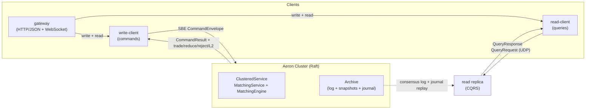

# JUSTRADE - Deterministic Spot Exchange Platform

[](https://github.com/justrade-io/justrade/actions/workflows/ci.yml)
[](LICENSE)
[](gradle.properties)
[](gradle/wrapper/gradle-wrapper.properties)
[](README.md)

justrade is a production-oriented spot exchange in Java: a deterministic,
in-memory matching engine (price-time order book, maker/taker fees) replicated
by Aeron Cluster (Raft), with a CQRS read replica, write/read client SDKs, an
HTTP/WebSocket gateway, and deployment automation for AWS and Docker.

## Documentation

New to exchanges or to justrade? Start with the concept guides. Everything is
indexed in the [documentation hub](docs/README.md).

- New to trading: [Exchange 101](docs/concepts/exchange-101.md) and the
  [concept guides](docs/concepts/README.md).
- Run it: [Getting started](docs/getting-started.md).
- Use the API: [API usage](docs/API-USAGE.md) and the
  [OpenAPI contract](docs/openapi.yaml).
- Understand the design: [Architecture](docs/ARCHITECTURE.md) and the
  [Architecture Decision Records](docs/decisions/README.md).
- Deploy it: [deploy/aws](deploy/aws/README.md) or `docker/`. Measure it:
  [BENCHMARKING-XCORE.md](docs/BENCHMARKING-XCORE.md) and the
  [performance budget](docs/decisions/performance-budget.md).
- Reference: [Glossary](docs/GLOSSARY.md).
- Contribute: [Contributing](CONTRIBUTING.md),
  [Code of Conduct](CODE_OF_CONDUCT.md), [Security](SECURITY.md),
  [Changelog](CHANGELOG.md).

## What is this

justrade ports the **matching semantics** of
[exchange-core](https://github.com/exchange-core/exchange-core) - price-time
priority, GTC / IOC / FOK-BUDGET orders, direct-exchange spot risk with
maker/taker fees - and rebuilds everything around them on the Aeron ecosystem.
The port is parity-tested: a deterministic replay of exchange-core's own
workload generator must produce identical trades, rejects, reduces, and a
byte-identical L2 book on both engines (see
[docs/BENCHMARKING-XCORE.md](docs/BENCHMARKING-XCORE.md)).

This is therefore not "just a matching engine" - it is a complete, deployable
exchange: consensus, engine, read side, client SDKs, gateway, and ops tooling.

| Layer             | exchange-core (0.5.3)                        | justrade                                          |
|-------------------|----------------------------------------------|---------------------------------------------------|
| Matching model    | price-time, GTC / IOC / FOK-BUDGET, spot risk, maker/taker fees | ported (parity-tested)         |
| Engine runtime    | LMAX Disruptor pipeline                      | single-thread `ClusteredService`, allocation-free hot path |
| Replication       | none (single process)                        | Aeron Cluster (Raft), exactly-once                |
| Wire format       | Chronicle-Wire                               | SBE flyweights (zero-copy, no reflection)         |
| Read path         | in-process API                               | CQRS read replica + query protocol                |
| Journaling        | local disk + LZ4 snapshots                   | HA journal + snapshots on the Aeron Archive       |
| Client access     | in-process API                               | write/read SDKs + HTTP/WebSocket gateway          |
| Operations        | -                                            | Docker, AWS (Terraform + Ansible), dev script     |

## System diagram



## Why

Matching engines are correctness-critical. Price-time priority must be fair,
settlement must conserve value (including fees), every command must apply
exactly once even across retries and leader failover, and results must be
reproducible for audit and reconciliation. The hot path must stay fast and
predictable under load.

justrade solves this as a single deterministic state machine replicated by
Aeron Cluster (Raft). The engine has no clock, no randomness, no floating
point, and no unordered iteration: identical input logs produce byte-identical
state and snapshots on every node and every rerun. Commands are idempotent by
design, and the steady-state hot path allocates nothing.

## Highlights

- **Deterministic and reproducible** - identical input logs produce
  byte-identical state, snapshots, and state hashes on every node, so replicas
  and archived logs can always be reconciled with each other.
- **Exactly-once, even across failover** - a per-client dedup window
  (`clientId`, `clientSeq`) makes every command idempotent: client retries, a
  leader change, or a killed leader can never double-apply a command.
- **Zero-allocation hot path** - decode, match, settle, and ACK allocate
  nothing in steady state; resting orders are pooled. The latency contract is
  the tail, not the mean: p99.99 governs.
- **Financially correct settlement** - integer-only 64-bit arithmetic with
  overflow checks, maker / taker fees, and value conservation across every
  trade including fees (a property test asserts taker + maker + fee is
  constant).
- **Audit-ready by default** - every committed trade / reduce / reject is
  written to a highly-available journal on the Aeron Archive, off the
  consensus thread: the producer blocks (never drops) until the journaler
  drains, and consumers dedup on `(logPosition, eventIndex)` for
  exactly-once delivery that survives a leader loss.
- **Reads without touching consensus** - a CQRS read replica follows a
  member's archive, rebuilds per-user order history and a market trade tape
  from the log, and answers queries over a plain Aeron protocol.

## Quick start

Requires JDK 21 and Linux (the Aeron media driver). Run tasks set the required
`--add-opens` flags automatically.

```bash
# In-process single-node cluster that prints every egress event
./gradlew :examples:run

# Full local stack: 3-node cluster + CQRS read replica + gateway (:8080)
./scripts/justrade-dev.sh start
```

Single-node runs, the containerized end-to-end test, driving the engine
directly, and the REST/WebSocket walkthrough are in
[docs/getting-started.md](docs/getting-started.md) and
[docs/API-USAGE.md](docs/API-USAGE.md).

## Scope

Current scope is a single-region, non-sharded spot exchange: direct-exchange
(spot) risk only, one order book per symbol, and a single cluster membership.
Out of scope for now:

- Margin / derivative risk models.
- Symbol or user sharding across multiple clusters.
- Multi-region deployment.

The read replica and journal consumers already scale independently of consensus;
see [docs/ARCHITECTURE.md](docs/ARCHITECTURE.md) for the boundary.

## Performance

Indicative JMH numbers on x86_64 Linux, JDK 21 (steady state, zero allocation):

| Operation                      | Time         |
|--------------------------------|--------------|
| Envelope decode / encode       | ~2 / ~3.7 ns |
| IOC match (1 fill, deep book)  | ~6.2 ns      |
| Full dispatch (place + cancel) | ~84 ns       |

Targets: decode < 100 ns, primitive-map lookup < 50 ns, end-to-end IPC p99.99
< 50 us, hot-path allocation 0 bytes.

Deployed 3-node AWS cluster (`c6i.xlarge`, end-to-end including consensus +
replication + archive):

| Workload                                    | Throughput | p50    | p99    | p99.99  |
|---------------------------------------------|-----------:|-------:|-------:|--------:|
| `LoadWorkload` (256 symbols, 5000 users)    | 141k ops/s | 565 us | 3.9 ms | -       |
| exchange-core workload (1 symbol, 1000 users) | 183k ops/s | 498 us | 1.1 ms | 21.7 ms |

The exchange-core workload (single symbol, 3M commands, 9% GTC / 3% IOC / 6%
cancel / 82% move) also reports a latency table: p50 281-551 us from 25k to
100k ops/s. These are end-to-end figures; the matching-only hot path is orders
of magnitude faster (see the JMH rows above).

- Budget: [docs/decisions/performance-budget.md](docs/decisions/performance-budget.md).
- exchange-core parity and methodology: [docs/BENCHMARKING-XCORE.md](docs/BENCHMARKING-XCORE.md).
- Deployed AWS numbers and sizing: [deploy/aws/PERFORMANCE.md](deploy/aws/PERFORMANCE.md).
- Configuration and capacities: [docs/getting-started.md](docs/getting-started.md#configuration) and [docs/ARCHITECTURE.md](docs/ARCHITECTURE.md#configuration).

## Modules

| Module              | Responsibility                                                   |
|---------------------|------------------------------------------------------------------|
| [`protocol`](protocol/README.md)      | SBE schema and generated flyweight codecs (wire contract only)   |
| [`core`](core/README.md)          | Deterministic engine: order book, risk, dedup, snapshot, journal, telemetry |
| [`launcher`](launcher/README.md)      | Aeron bootstrap: media driver, archive, consensus, container     |
| [`write-client`](write-client/README.md)  | Write-side SDK: leader-change handling, idempotent retry, egress events |
| [`read`](read/README.md)          | CQRS read replica and HA journal consumers (order ledger, trade tape) |
| [`read-client`](read-client/README.md)   | Read-side SDK over plain Aeron request/response streams          |
| [`gateway`](gateway/README.md)       | HTTP/JSON + WebSocket boundary over the read/write SDKs (REST, streaming; see [docs/GATEWAY.md](docs/GATEWAY.md)) |
| [`bench`](bench/README.md)         | End-to-end latency harness (HdrHistogram tails)                  |
| [`xcore-bench`](xcore-bench/README.md)   | Comparative benchmarks vs exchange-core 0.5.3                    |
| [`examples`](examples/README.md)      | Runnable examples (in-process cluster + client SDK)              |
| [`tests`](tests/README.md)         | Unit, property, integration, cluster, and fault suites           |

Details - wire and snapshot formats, data flows, determinism rules, and
order-book semantics - live in [docs/ARCHITECTURE.md](docs/ARCHITECTURE.md).

## License

MIT License. See [LICENSE](LICENSE).

## Credits

Built on [Aeron](https://github.com/aeron-io/aeron),
[Agrona](https://github.com/aeron-io/agrona), and
[Simple Binary Encoding](https://github.com/aeron-io/simple-binary-encoding).
The matching model is ported from
[exchange-core](https://github.com/exchange-core/exchange-core); see
[What is this](#what-is-this) and
[docs/BENCHMARKING-XCORE.md](docs/BENCHMARKING-XCORE.md).
