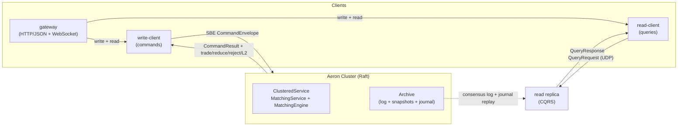

# justrade - Deterministic Spot Exchange Platform

[](https://github.com/justrade-io/justrade/actions/workflows/ci.yml)
[](LICENSE)
[](gradle.properties)
[](gradle/wrapper/gradle-wrapper.properties)
[](README.md)

justrade is a production-oriented spot exchange in Java: a deterministic,
in-memory matching engine (price-time order book, maker/taker fees) replicated
by Aeron Cluster (Raft), with a CQRS read replica, write/read client SDKs, an
HTTP/WebSocket gateway, and deployment automation for AWS and Docker.

## What is this

justrade ports the **matching semantics** of
[exchange-core](https://github.com/exchange-core/exchange-core) - price-time
priority, GTC / IOC / FOK-BUDGET orders, direct-exchange spot risk with
maker/taker fees - and rebuilds everything around them on the Aeron ecosystem.
The port is parity-tested: a deterministic replay of exchange-core's own
workload generator must produce identical trades, rejects, reduces, and a
byte-identical L2 book on both engines (see
[Comparison with exchange-core](#comparison-with-exchange-core)).

This is therefore not "just a matching engine" - it is a complete, deployable
exchange: consensus, engine, read side, client SDKs, gateway, and ops tooling.

| Layer             | exchange-core (0.5.3)                        | justrade                                          |
|-------------------|----------------------------------------------|---------------------------------------------------|
| Matching model    | price-time, GTC / IOC / FOK-BUDGET, spot risk, maker/taker fees | ported (parity-tested)         |
| Engine runtime    | LMAX Disruptor pipeline                      | single-thread `ClusteredService`, allocation-free hot path |
| Replication       | none (single process)                        | Aeron Cluster (Raft), exactly-once                |
| Wire format       | Chronicle-Wire                               | SBE flyweights (zero-copy, no reflection)         |
| Read path         | in-process API                               | CQRS read replica + query protocol                |
| Journaling        | local disk + LZ4 snapshots                   | HA journal + snapshots on the Aeron Archive       |
| Client access     | in-process API                               | write/read SDKs + HTTP/WebSocket gateway          |
| Operations        | -                                            | Docker, AWS (Terraform + Ansible), dev script     |

## System diagram



## Why

Matching engines are correctness-critical. Price-time priority must be fair,
settlement must conserve value (including fees), every command must apply
exactly once even across retries and leader failover, and results must be
reproducible for audit and reconciliation. The hot path must stay fast and
predictable under load.

justrade solves this as a single deterministic state machine replicated by
Aeron Cluster (Raft). The engine has no clock, no randomness, no floating
point, and no unordered iteration: identical input logs produce byte-identical
state and snapshots on every node and every rerun. Commands are idempotent by
design, and the steady-state hot path allocates nothing.

## Highlights

- **Deterministic and reproducible** - identical input logs produce
  byte-identical state, snapshots, and state hashes on every node, so replicas
  and archived logs can always be reconciled with each other.
- **Exactly-once, even across failover** - a per-client dedup window
  (`clientId`, `clientSeq`) makes every command idempotent: client retries, a
  leader change, or a killed leader can never double-apply a command.
- **Zero-allocation hot path** - decode, match, settle, and ACK allocate
  nothing in steady state; resting orders are pooled. The latency contract is
  the tail, not the mean: p99.99 governs.
- **Financially correct settlement** - integer-only 64-bit arithmetic with
  overflow checks, maker / taker fees, and value conservation across every
  trade including fees (a property test asserts taker + maker + fee is
  constant).
- **Audit-ready by default** - every committed trade / reduce / reject is
  written to a highly-available journal on the Aeron Archive, off the
  consensus thread: the producer blocks (never drops) until the journaler
  drains, and consumers dedup on `(logPosition, eventIndex)` for
  exactly-once delivery that survives a leader loss.
- **Reads without touching consensus** - a CQRS read replica follows a
  member's archive, rebuilds per-user order history and a market trade tape
  from the log, and answers queries over a plain Aeron protocol.

## Features

- Price-time priority order book: GTC, IOC, and FOK-BUDGET orders, plus
  PLACE / CANCEL / MOVE / REDUCE.
- Direct-exchange spot risk: funds reserved on placement, settled at the fill
  price, released on cancel / reduce; maker / taker fees accrue to a fee
  account (no margin).
- Account lifecycle: ADD_USER, BALANCE_ADJUSTMENT, ADD_SYMBOL, SUSPEND_USER /
  RESUME_USER, RESET, NOP.
- Native deterministic snapshots: engine state streamed to the Archive in
  sorted key order with an integrity checksum; warm restart replays only the
  remaining log.
- SBE wire format: fixed binary layout, no reflection, backward-compatible
  schema evolution via optional fields.
- Write-side SDK: leader-change handling, idempotent retry, correlation, and
  full egress event delivery (trade / reduce / reject, L2, per-command fills).
- Read-side SDK: balances, L2 book, user reports, order history, trade tape,
  and value-conservation totals over request/response streams, with idempotent
  retry and a bounded in-flight window.
- HTTP/JSON + WebSocket gateway: REST endpoints over the read/write SDKs plus
  streaming market events (see [docs/GATEWAY.md](docs/GATEWAY.md) and
  [docs/API-USAGE.md](docs/API-USAGE.md); machine-readable contract in
  [docs/openapi.yaml](docs/openapi.yaml)).
- Off-heap telemetry: single-writer counters mirrored to a standalone
  `CountersManager`, readable from any thread without perturbing the hot path.

## Quick Start

Requires JDK 21 and Linux (Aeron media driver). The launcher, read, bench, and
example configurations set the required `--add-opens` JVM flags automatically.

```bash
# Runnable example: in-process single-node cluster, prints every egress event
./gradlew :examples:run

# Single-node localhost cluster
./gradlew :launcher:run

# Read replica following a member's archive (answers queries on port 44000)
./gradlew :read:run --args="--archive=aeron:udp?endpoint=localhost:20104"
```

### Full dev stack (cluster + read replica + gateway)

```bash
# Start a 3-node cluster, a CQRS read replica, and the HTTP/WebSocket gateway
./scripts/justrade-dev.sh start

# Seed a sample symbol and two funded users
./scripts/justrade-dev.sh seed

# Place a resting GTC ask over the REST API (gateway on :8080)
curl -s -X POST http://localhost:8080/api/v1/orders \
  -H 'Content-Type: application/json' \
  -d '{"symbolId":1,"orderId":100,"ask":true,"type":"GTC","price":100,"size":10,"reserveBidPrice":0,"uid":811,"userCookie":1}'

./scripts/justrade-dev.sh stop
```

See [docs/API-USAGE.md](docs/API-USAGE.md) for the full REST/WebSocket guide.

The engine has no Aeron dependency, so it can be driven directly from a decoded
command:

```java
MatchingEngine engine = new MatchingEngine(CoreConfig.defaults(), new CoreMetrics());
CommandOutcome outcome = new CommandOutcome();
boolean duplicate = engine.process(commandDecoder, /* leader timestamp */ 1_000L, outcome);
```

Containerized end-to-end system test (3-node Raft cluster + read replica +
write load + read verify; exit 0 = all checks passed):

```bash
docker compose -f docker/docker-compose.yml up --build
```

Multi-symbol (and other workload knobs) via env vars, e.g. `JUSTRADE_SYMBOLS=4`
(see [Configuration](#configuration)).

## Scope

Current scope is a single-region, non-sharded spot exchange: direct-exchange
(spot) risk only, one order book per symbol, and a single cluster membership.
Out of scope for now:

- Margin / derivative risk models.
- Symbol or user sharding across multiple clusters.
- Multi-region deployment.

The read replica and journal consumers already scale independently of consensus;
see [docs/ARCHITECTURE.md](docs/ARCHITECTURE.md) for the boundary.

## Configuration

Engine and ledger capacities are read at launch, not hardcoded, so a deployment
can be sized without a rebuild:

- `CoreConfig` capacities via `justrade.core.*` properties (`ClusterLauncher`
  `--config=<file>`, `ReadServiceLauncher` `--core-config=<file>`) or
  `-Djustrade.core.*` system properties.
- Aeron ingress term length via `justrade.aeron.termLength` (default `64k`).
- Read-side ledger caps via `--ledger-max-orders-per-user` /
  `--ledger-max-market-trades` (defaults 4096 / 65536) and the verifiers'
  `--trade-limit` (default 4096).
- Workload shape via `--ops` / `--users` / `--symbols` on the bench runners, or
  `JUSTRADE_OPS` / `JUSTRADE_USERS` / `JUSTRADE_SYMBOLS` in the containerized / Ansible
  deployments.

See [docs/ARCHITECTURE.md](docs/ARCHITECTURE.md#configuration) for the full
capacity table and [deploy/aws/PERFORMANCE.md](deploy/aws/PERFORMANCE.md) for
sizing guidance.

## Comparison with exchange-core

The `xcore-bench` module benchmarks justrade against upstream exchange-core
0.5.3 at three layers: matching-only (`book`), full engine dispatch
(`engine`), and cluster end-to-end (`e2e`). The `book` mode doubles as a
parity test: justrade's book is the reference, and exchange-core must produce
identical trade / reject / reduce counters and a byte-identical L2 on the same
replayed workload, or the run fails.

Only `book` is strictly apples-to-apples (both run the matching-only path on
the caller thread). The `engine` and `e2e` layers compare different system
shapes - the justrade `e2e` number pays for Raft commit and archive recording
on every command, which exchange-core does not have. Read the fairness notes
before quoting numbers.

```bash
./gradlew :xcore-bench:run --args="--mode=book --commands=3000000 --target-orders=1000 --iterations=3"
./gradlew :xcore-bench:run --args="--mode=engine --warmup=200000 --ops=1000000"
./gradlew :xcore-bench:run --args="--mode=e2e --warmup=20000 --ops=200000"
```

Full methodology, fairness caveats, and interpretation in
[docs/BENCHMARKING-XCORE.md](docs/BENCHMARKING-XCORE.md).

## Performance

Indicative JMH numbers on x86_64 Linux, JDK 21 (steady state, zero allocation):

| Operation                      | Time    |
|--------------------------------|---------|
| Envelope decode / encode       | ~2 / ~3.7 ns |
| IOC match (1 fill, deep book)  | ~6.2 ns |
| Full dispatch (place + cancel) | ~84 ns  |
| Journal emit (4 events)        | ~41.6 ns |

Targets: decode < 100 ns, primitive-map lookup < 50 ns, end-to-end IPC p99.99
< 50 us, hot-path allocation 0 bytes. The `xcore-bench` module benchmarks
against upstream exchange-core 0.5.3 (replay parity, engine and e2e latency,
JMH) - see [docs/BENCHMARKING-XCORE.md](docs/BENCHMARKING-XCORE.md).

### End-to-end (deployed AWS cluster)

A throwaway AWS benchmark (see
[deploy/aws/PERFORMANCE.md](deploy/aws/PERFORMANCE.md)) drives the deterministic
`LoadWorkload` through the write client against a real 3-node cluster and
verifies the state on the CQRS read replica.

Topology (`ap-southeast-1`, single AZ):

| Role | Count | Instance |
|------|-------|----------|
| Aeron Raft node (cluster placement group) | 3 | `c6i.xlarge` (4 vCPU / 8 GB) |
| CQRS read replica | 1 | `c6i.xlarge` |
| Write load / read verify | 1 each | `c6i.xlarge` |

Server config: JVM ZGC `-Xms4g -Xmx4g` on nodes and read replica, Aeron ingress
term length `1m`, 16 MB socket buffers, read ledger `maxMarketTrades = 2^21`.
Workload: 5,000,000 ops / 256 symbols / 5000 users from a single closed-loop
write client (drain batch 128). Batch 16 measured 33,710 ops/s on the same
topology, so batch 128 is a ~4.2x lift (full comparison in PERFORMANCE.md).

| Metric | Value |
|--------|-------|
| Throughput | 141,174 ops/s |
| End-to-end latency (p50 / p99 / p99.9) | 565us / 3.9ms / 6.0ms |
| Fills observed vs expected | 1,562,432 == 1,562,432 |
| Command results | 5,015,256 success, 0 non-success, 0 expired |
| Session | 0 leader changes, 0 reconnects, 0 retransmits |
| Read-side verification | PASS (state hash matched, 15,259 queries) |

## Modules

| Module              | Responsibility                                                   |
|---------------------|------------------------------------------------------------------|
| `protocol`      | SBE schema and generated flyweight codecs (wire contract only)   |
| `core`          | Deterministic engine: order book, risk, dedup, snapshot, journal, telemetry |
| `launcher`      | Aeron bootstrap: media driver, archive, consensus, container     |
| `write-client`  | Write-side SDK: leader-change handling, idempotent retry, egress events |
| `read`          | CQRS read replica and HA journal consumers (order ledger, trade tape) |
| `read-client`   | Read-side SDK over plain Aeron request/response streams          |
| `gateway`       | HTTP/JSON + WebSocket boundary over the read/write SDKs (REST, streaming; see [docs/GATEWAY.md](docs/GATEWAY.md)) |
| `bench`         | End-to-end latency harness (HdrHistogram tails)                  |
| `xcore-bench`   | Comparative benchmarks vs exchange-core 0.5.3                    |
| `examples`      | Runnable examples (in-process cluster + client SDK)              |
| `tests`         | Unit, property, integration, cluster, and fault suites           |

Details - wire and snapshot formats, data flows, determinism rules, and
order-book semantics - live in [docs/ARCHITECTURE.md](docs/ARCHITECTURE.md).

## Testing

```bash
./gradlew test            # unit + property tests
./gradlew integrationTest # in-process single-node cluster
./gradlew clusterTest faultTest  # multi-node and fault-injection suites (in the default `check` gate)
```

## License

MIT License. See [LICENSE](LICENSE).

## Credits

Built on [Aeron](https://github.com/aeron-io/aeron),
[Agrona](https://github.com/aeron-io/agrona), and
[Simple Binary Encoding](https://github.com/aeron-io/simple-binary-encoding).
The matching model is ported from
[exchange-core](https://github.com/exchange-core/exchange-core); see
[What is this](#what-is-this) and
[Comparison with exchange-core](#comparison-with-exchange-core).
