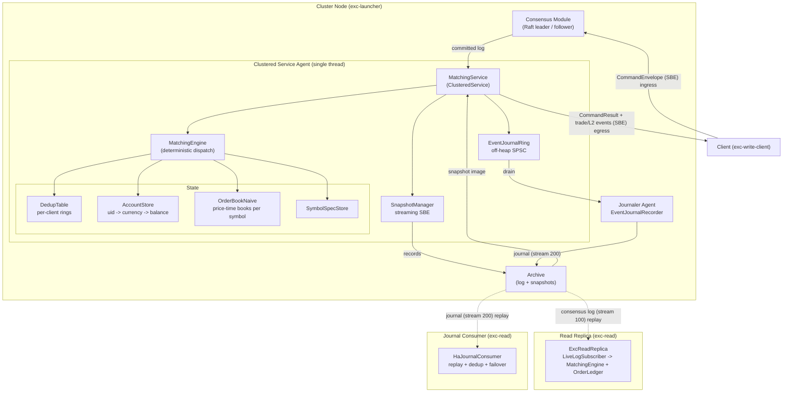

# excoredum - Aeron-Hosted Spot Matching Engine

A deterministic, replicated, in-memory spot exchange matching engine in Java,
built on Aeron Cluster. It re-hosts the exchange-core matching model as a single
Aeron `ClusteredService`: strong consistency, ultra-low latency, and an
allocation-free hot path for a core order book and its balances.

## Overview

excoredum is a strongly consistent order-matching engine for low-latency,
high-throughput workloads. It runs as one Aeron `ClusteredService` replicated by
Raft and does exactly one thing well: execute deterministic state transitions
over an order book and its account balances. Every command is idempotent, every
result is byte-reproducible across nodes, and the steady-state hot path allocates
nothing.

It ports the matching semantics of exchange-core (price-time priority, GTC / IOC
/ FOK-BUDGET orders, direct-exchange spot risk with maker / taker fees) onto the
Aeron ecosystem, replacing exchange-core's bespoke disk journal and Chronicle-Wire
snapshots with the Aeron consensus log, native cluster snapshots, and a
highly-available domain event journal on the Aeron Archive.

## Features

- **Deterministic**: identical input logs produce byte-identical state and
  snapshots across nodes and reruns. No clock, no randomness, no unordered
  iteration in the engine.
- **Idempotent**: a per-client dedup window guarantees every command is applied
  at most once, even across client retries and leader failover.
- **Allocation-Free Hot Path**: zero heap allocation during decode, match,
  settle, and ACK in steady state; resting orders are pooled.
- **Lock-Free Single-Writer**: one clustered-service thread owns all state; no
  locks, no contention.
- **Integer-Only Money Math**: 64-bit fixed-scale amounts with overflow-checked
  arithmetic; no floating point anywhere in the matching or settlement path.
- **Price-Time Matching**: a naive order book with strict price-time priority for
  GTC, IOC, and FOK-BUDGET orders, plus PLACE / CANCEL / MOVE / REDUCE.
- **Direct-Exchange Risk with Fees**: funds are reserved on placement, settled at
  the actual fill price with maker / taker fees accruing to a fee account, and
  released on cancel / reduce, with value conserved across every trade including
  fees (no margin in this delivery).
- **User Lifecycle**: accounts can be suspended and resumed; a suspended user is
  blocked from placing new orders while its balances stay intact.
- **Native Snapshots**: engine state (symbols, accounts, resting orders, dedup)
  is streamed to the Archive in deterministic key order with an integrity
  checksum; recovery loads the snapshot and replays the remaining log.
- **Fault-Tolerant Failover**: a multi-node Raft cluster elects a leader and
  catches up on restart; in-flight commands are retried idempotently across
  leader changes with no double-apply.
- **SBE Wire Format**: fixed little-endian binary layout, no reflection,
  backward-compatible schema evolution via optional fields.
- **CQRS Read Replica**: `exc-read` runs a non-voting node that follows a cluster
  member's Aeron Archive and reproduces engine state for eventually-consistent
  reads (L2 order-book snapshots, balances, user reports), without joining Raft
  or affecting quorum.
- **Read-Side Query SDK**: `exc-read-client` lets internal services query a read
  replica over the wire (`userExists`, `balance`, L2 order book, user reports,
  order history, trade tape, conservation totals) with request-id correlation
  and idempotent retry, decoupled from `exc-core` exactly like `exc-write-client`.
- **Order History and Trade Tape**: the read replica rebuilds a per-user order
  lifecycle ledger (state, fills, order type, `userCookie`) and a bounded market
  trade tape directly from the replicated log - covering every order placed by
  any client, identical across replicas, and rebuilt on restart by replaying the
  log.
- **HA Domain Event Journal**: every node records a durable, semantic stream of
  trade / reduce / reject events to the Aeron Archive off the consensus thread;
  consumers replay it and dedup on `(logPosition, eventIndex)` for exactly-once
  delivery that survives a leader kill and follows a live source across failover.
- **Off-Heap Telemetry**: core counters are mirrored to a standalone off-heap
  `CountersManager` so operators can read them from another thread without
  perturbing the single-writer hot path.

> Requires JDK 21 and Linux. Aeron/Agrona need the JVM flags
> `--add-opens java.base/jdk.internal.misc=ALL-UNNAMED` and
> `--add-opens java.base/sun.nio.ch=ALL-UNNAMED` (the launcher, read, bench,
> examples, and xcore-bench application configs set these automatically).

## Requirements

- JDK 21 (LTS). The Gradle toolchain enforces language level 21.
- Linux (Aeron's default media driver targets Linux).
- Built on Aeron 1.48, Agrona 2.2, Simple Binary Encoding 1.35.

## Build

excoredum is a Gradle multi-module project. Build it from source:

```bash
git clone <repo-url> excoredum && cd excoredum
./gradlew build
```

To embed the engine in another Gradle build, depend on the core module (or on
`exc-write-client` for the write-side client SDK, which links only the wire
contract):

```kotlin
dependencies {
    implementation(project(":exc-core"))    // deterministic matching engine
    implementation(project(":exc-write-client"))  // write-side client SDK (protocol only)
}
```

## Quick Start

### Run the runnable example

`exc-examples` boots an in-process single-node cluster and walks a small trading
scenario through the client SDK, printing every egress surface as it happens -
per-fill trades, per-command trade groups, a reduce, a reject, and an L2
snapshot:

```bash
./gradlew :exc-examples:run
```

```text
  [trade ] maker=1(uid 1) x taker uid 2: 4 @ 100 (maker completed)
  [trade ] maker=3(uid 1) x taker uid 2: 1 @ 101
  [group ] command=11: 2 fill(s), totalVolume=5, taker uid 2
  [reduce] order=3 uid 1 reduced by 3 @ 101 (order completed)
  [reject] order=5 uid 2 rejected 5 @ 100
  [l2    ] asks: 102x2 | bids: empty
```

### Drive a single-node cluster with the client SDK

`exc-write-client` is the write-side client SDK. It depends only on the `exc-protocol` wire
contract (never on `exc-core`) and handles leader changes, idempotent retry,
result correlation, and full egress event delivery. This snippet boots an
in-process single-node cluster, funds a maker and a taker, and crosses an order
to produce a trade:

```java
import com.exadbe.write.client.ExcClient;
import com.exadbe.write.client.config.ClientConfig;
import com.exadbe.config.CoreConfig;
import com.exadbe.launcher.ClusterConfig;
import com.exadbe.launcher.ClusterNode;

int sym = 1, base = 10, quote = 20;
long maker = 1L, taker = 2L;

try (ClusterNode node = new ClusterNode(ClusterConfig.singleNodeLocalhost(0, baseDir), CoreConfig.defaults())) {
    ClientConfig config = ClientConfig.builder(1L, ClusterConfig.ingressEndpoints(1)).build();

    try (ExcClient client = new ExcClient(config,
            (idHi, idLo, code, uid, hasUid, orderId, hasOrderId, filledSize, hasFilledSize) ->
                System.out.println("result " + code + (hasFilledSize ? " filled=" + filledSize : "")))) {

        client.tradeListener((idHi, idLo, index, symbolId, makerOrderId, makerUid, takerUid, price, size, done) ->
            System.out.println("TRADE price=" + price + " size=" + size));

        client.reduceListener((idHi, idLo, index, symbolId, orderId, uid, reducedBy, price, completed) ->
            System.out.println("REDUCE order=" + orderId + " by=" + reducedBy + " @ " + price));

        client.rejectListener((idHi, idLo, index, symbolId, orderId, uid, rejectedSize, price) ->
            System.out.println("REJECT order=" + orderId + " size=" + rejectedSize));

        client.tradeGroupListener(group -> // one callback per taker command, all its fills
            System.out.println("GROUP fills=" + group.fillCount() + " totalVolume=" + group.totalVolume()));

        client.orderBookListener(snapshot -> // L2 snapshot for an ORDER_BOOK_REQUEST
            System.out.println("L2 asks=" + snapshot.askDepth() + " bids=" + snapshot.bidDepth()));

        client.addSymbol(sym, base, quote, 1L, 1L);   // baseScaleK = quoteScaleK = 1
        client.addUser(maker);
        client.adjustBalance(maker, base, 1_000L);      // maker funds base to sell
        client.addUser(taker);
        client.adjustBalance(taker, quote, 1_000_000L); // taker funds quote to buy

        client.placeGtc(sym, 1L, /* ask */ true, 100L, 10L, 0L, maker, /* userCookie */ 0);   // resting ask @100 x10
        client.placeGtc(sym, 2L, /* bid */ false, 105L, 6L, 105L, taker, /* userCookie */ 0); // crosses, fills 6 @100

        for (int i = 0; i < 100_000 && client.pendingCount() > 0; i++) {
            client.poll(); // drives egress delivery, event decode, and idempotent retransmission
        }
    }
}
```

Resubmitting the same `clientId` and `clientSeq` returns the cached result and
does not re-apply the command (and re-sends no events). Every `CommandResult`
carries `eventCount`, the number of matcher-event frames that follow it, which
the client uses to deliver each command's fills as one complete `TradeGroup`;
the per-fill `tradeListener` fires independently of the group. `ReduceEvent`
frames carry the resting price and whether the order was fully removed;
`RejectEvent` frames carry the active order's price (the budget for FOK-BUDGET).
See `exc-examples` for the complete runnable version.

### Drive the engine directly (no cluster)

`MatchingEngine` has no Aeron dependency, so it can be driven straight from a
decoded `CommandEnvelope`, exactly as the unit tests do:

```java
MatchingEngine engine = new MatchingEngine(CoreConfig.defaults(), new CoreMetrics());
CommandOutcome outcome = new CommandOutcome();
boolean duplicate = engine.process(commandDecoder, /* leader timestamp */ 1_000L, outcome);
System.out.println(outcome.resultCode()); // e.g. SUCCESS
```

### Run a cluster node

```bash
# Single-node localhost cluster
./gradlew :exc-launcher:run

# Node 1 of a multi-node cluster, preserving prior state across restarts
./gradlew :exc-launcher:run -Dexc.nodeId=1 -Dexc.cleanStart=false

# Node with an explicit base directory
./gradlew :exc-launcher:run -Dexc.nodeId=1 -Dexc.baseDir=build/exc-node-1

# From a deployment properties file (must define exc.clusterMembers)
# --config=<file> and its -Dexc.config=<file> alias are equivalent
./gradlew :exc-launcher:run --args="--config=production.properties"
```

### Run a read replica

```bash
./gradlew :exc-read:run --args="--archive=aeron:udp?endpoint=localhost:20104"
```

`--archive` also accepts a comma-separated list of member archive control
channels: the first is the primary source and the replica fails over to the rest
(in order) when it dies. Because recording positions are cluster-global (every
member records the same committed consensus log), the replica **resumes the
replay from the position already applied** instead of rebuilding its state, so
`appliedPosition` is monotonic across the switch and the catch-up window is just
the tail. The read model is eventually consistent, so there is a brief
catch-up window after failover.

Optional flags: `--checkpoint=<file>` enables local checkpoint persistence
(engine + ledger + applied position, written periodically and at shutdown); a
warm start loads the checkpoint and resumes from the stored position instead of
replaying history. On a cold start the replica also bootstraps its engine from
the newest cluster snapshot found on the source Archive, when one exists.

The read service also answers queries on the query protocol (default
`aeron:udp?endpoint=localhost:44000`, stream 300). Query it from any internal
service with the `exc-read-client` SDK, which depends only on `exc-protocol`:

```java
import com.exadbe.read.client.ReadClient;
import com.exadbe.read.client.L2Snapshot;
import com.exadbe.read.client.UserReport;
import com.exadbe.read.client.config.ReadClientConfig;

try (ReadClient client = new ReadClient(ReadClientConfig.builder().build())) {
    boolean exists = client.userExists(42L);                        // replicated account?
    long balance = client.balance(42L, 10).balance();               // free balance, currency 10
    L2Snapshot l2 = client.orderBook(1, 10);                        // best 10 levels per side
    UserReport report = client.singleUserReport(42L);               // status + balances + resting orders
    long stateHash = client.stateHash();                            // deterministic fingerprint
    long appliedPosition = client.lastAppliedPosition();            // replica's log position
}
```

Queries block until answered or the retry budget is exhausted
(`QueryTimeoutException`), are eventually consistent, and each result carries
the replica's `appliedPosition` at answer time. Reads are retried idempotently
(re-publishing the same request id), so a read service restart between attempts
is harmless.

The same client also exposes an asynchronous mode mirroring `ExcClient`:
`submitBalance(...)`-style methods return a `requestId` without blocking,
`poll()` drives delivery, and a registered `QueryListener` receives each result
(plus `onTimeout` / `onError`), with a bounded in-flight window that throws
`BackpressureException` when full.

## How It Works

excoredum is a replicated state machine. Commands flow through Aeron Cluster and
arrive at `MatchingService` in total order on a single thread:

1. **Dispatch**: `onSessionMessage` decodes the SBE envelope. The dedup table is
   checked first; a hit returns the cached result verbatim. A miss dispatches to
   the engine (add symbol / add user / balance adjustment / suspend / resume user /
   place / cancel / move / reduce / order-book request / reset / nop).
2. **Match and settle**: order commands run against the per-symbol order book with
   price-time priority. Funds are reserved before matching, settled at the actual
   fill price, and any over-reserve released. Trades, reduces, and rejects are
   recorded into a reusable outcome buffer.
3. **Idempotency**: because `clientSeq` is monotonic per client, its dedup slot is
   `seq & (capacity - 1)`, so lookup and store are O(1) and allocation-free.
4. **ACK and events**: the result is encoded as an SBE `CommandResult` carrying
   the original `commandId`; trade / reduce / reject events and (for an order-book
   request) an `L2MarketData` frame are offered to egress.
5. **Snapshot and recovery**: on a controlled trigger, state is streamed to the
   Archive in deterministic key order (including the dedup table). On restart the
   snapshot is loaded and the remaining log is replayed.
6. **Domain event journal**: on every node, committed trade / reduce / reject
   events are encoded into an off-heap ring and drained by a journaler agent to a
   recorded Aeron stream, off the consensus thread. Consumers replay it and dedup
   on `(logPosition, eventIndex)` for exactly-once delivery that survives a leader
   loss.

The business logic lives in `MatchingEngine`, which has no Aeron dependency and
is therefore unit and replay testable in isolation.

## Configuration

Capacities are preallocated in `CoreConfig`; ring capacities are validated as
power-of-two where they index a ring:

| Setting                 | Default | Purpose                                   |
|-------------------------|---------|-------------------------------------------|
| `symbolCapacity`        | 2^10    | Preallocated symbol-spec slots            |
| `accountCapacity`       | 2^16    | Preallocated account-map slots            |
| `dedupClientCapacity`   | 2^12    | Preallocated dedup clients                |
| `dedupWindow`           | 2^10    | Most recent commands retained per client  |
| `orderPoolCapacity`     | 2^16    | Retained free order nodes (reuse pool)    |
| `priceBucketCapacity`   | 2^13    | Retained free price levels (bucket pool)  |
| `eventBufferCapacity`   | 2^10    | Preallocated matcher events per command   |
| `journalSlotCount`      | 2^16    | Domain-event ring slots (power of two)    |
| `journalSlotSize`       | 128     | Bytes per journal ring slot               |
| `l2MaxLevels`           | 32      | Max L2 depth returned per side            |

`ClusterConfig` describes node id, cluster members, directories, and channels:
`singleNodeLocalhost` for local runs and integration tests, `multiNodeLocalhost`
for an in-process multi-node cluster, `fromMembers` for an explicit member
string, and `fromProperties` to load a node from a deployment properties file
(`exc.clusterMembers`, `exc.baseDir`, `exc.host`). `ingressEndpoints(nodeCount)`
renders the `id=host:port,...` endpoint list the write client needs.

Client SDK defaults: `ClientConfig` (write client) uses a 30 s `messageTimeoutNs`,
250 ms `retryBackoffNs`, unlimited retries (`maxRetries` 0 = retry indefinitely),
a 1024-command in-flight window, and a 2 s idle keepalive. `ReadClientConfig`
(read client) targets the default query channel `aeron:udp?endpoint=localhost:44000`
on stream 300 with responses on stream 301, a 5 s `messageTimeoutNs`, 250 ms
retry backoff, up to 5 retries, and a 1024-query in-flight window.

## Observability

Core counters are mirrored to a standalone off-heap `CountersManager` allocated by
`ClusterNode`, so an operator can read them from another thread without touching
the single-writer hot path. Counters include commands processed, duplicates,
backpressure, unsupported commands, snapshots taken / loaded, event-buffer
overflows, and order / price-bucket pool exhaustions; gauges record snapshot
write / read time. The hot path only increments a counter - no string formatting,
no allocation.

## Architecture



| Module         | Responsibility                                                            |
|----------------|---------------------------------------------------------------------------|
| `exc-protocol` | SBE schema and generated flyweight codecs (wire, egress events, query protocol, snapshot) |
| `exc-core`     | Deterministic matching engine, order book, risk, dedup, snapshot, telemetry, journal |
| `exc-launcher` | Aeron bootstrap: Media Driver, Archive, Consensus, Container, journaler agent |
| `exc-write-client` | Write-side client SDK: leader-change handling, idempotent retry, correlation, events |
| `exc-read`     | CQRS read side and journal consumers: log follower, replay, dedup, HA failover, order-history ledger and trade tape |
| `exc-read-client` | Read-side SDK: blocking queries over plain Aeron request/response streams (protocol only, like `exc-write-client`) |
| `exc-bench`    | End-to-end latency harness (in-process cluster + client, HdrHistogram)     |
| `exc-xcore-bench` | Comparative benchmarks vs exchange-core 0.5.3 (replay parity, latency, JMH) |
| `exc-tests`    | Unit, property, integration, cluster, fault tests and fixtures            |
| `exc-examples` | Runnable examples: in-process cluster driven through the client SDK       |

See [docs/ARCHITECTURE.md](docs/ARCHITECTURE.md) for the component map, wire and
snapshot formats, data flows, determinism rules, and order-book semantics.

## Performance

Indicative micro-benchmark results on x86_64 Linux, JDK 21 (JMH quick run):

| Operation                         | Time     | Notes                                 |
|-----------------------------------|----------|---------------------------------------|
| Envelope decode                   | ~2.0 ns  | SBE flyweight wrap plus field reads   |
| Envelope encode                   | ~3.7 ns  | SBE flyweight write                   |
| IOC match (1 fill vs deep book)   | ~6.2 ns  | price-time matching loop              |
| Resting place + cancel            | ~22.8 ns | pooled book insert and remove         |
| Full dispatch (place + cancel)    | ~84 ns   | dedup, symbol/user checks, risk, book |
| Journal emit (4 events + drain)   | ~41.6 ns | off-heap ring, zero-alloc producer    |

Run with the GC profiler to confirm zero steady-state allocation:

```bash
./gradlew :exc-core:jmh -Pjmh.profilers=gc
```

Performance targets (defaults; tune per service):

- Small message decode: < 100 ns (met)
- Primitive map lookup: < 50 ns (met)
- Steady-state allocation on the hot path: zero
- Tail latency, not mean, is the contract: p99.99 governs.

## Testing

```bash
# Unit and property tests
./gradlew test

# Integration tests (in-process single-node cluster)
./gradlew integrationTest

# Multi-node and fault-injection suites (also wired into the default check gate)
./gradlew clusterTest   # warm restart from a native snapshot
./gradlew faultTest     # kill the leader mid-flight, verify exactly-once failover
./gradlew soakTest      # opt-in soak task (no soak-tagged suites yet)

# Full local gate: format, lint, compile with warnings-as-errors, all tests
./gradlew spotlessApply checkstyleMain checkstyleTest compileJava test integrationTest
```

| Suite                              | Type        | What it covers                                          |
|------------------------------------|-------------|---------------------------------------------------------|
| `MatchingEngineTest`               | Unit        | Dedup, account handlers, suspend / resume, result codes |
| `OrderBookConformanceTest`         | Unit        | GTC / IOC / FOK-BUDGET, cancel / move / reduce, L2      |
| `SpotRiskTest`                     | Unit        | Reserve / settle / release, value conservation          |
| `FeeTest`                          | Unit        | Maker / taker fees, fee account, conservation with fees |
| `EventJournalTest`                 | Unit        | Journal ring order / back-pressure, encoding, dedup     |
| `EngineDeterminismTest`            | Property    | Replay determinism and sum-of-deltas (jqwik)            |
| `SnapshotRoundTripTest`            | Unit        | Byte-identical snapshot round trip and checksum         |
| `SnapshotIntegrityTest`            | Unit        | Truncation and corruption are rejected                  |
| `HotPathHardeningTest`             | Unit        | Node pooling, bounded event buffer, off-heap counters   |
| `ReportGeneratorTest`              | Unit        | Read-side reports: single-user, conservation totals, state hash |
| `OrderLedgerTest`                  | Unit        | Ledger lifecycle, fills, dedup skip, eviction, userCookie |
| `ExcClientIntegrationTest`         | Integration | Client submit / poll, command-id correlation            |
| `ExcClientKeepaliveIntegrationTest` | Integration | Idle client survives session timeout via NOP keepalives |
| `ExcAccountsIntegrationTest`       | Integration | Account lifecycle result codes end to end               |
| `ExcOrderBookIntegrationTest`      | Integration | Resting maker matched by taker, trade on egress         |
| `ExcReduceRejectEventsIntegrationTest` | Integration | Cancel / reduce / IOC / FOK reduce and reject on egress |
| `ExcEgressEventsIntegrationTest`   | Integration | Taker sweep as one trade group; L2 snapshot on egress   |
| `BenchHarnessSmokeTest`            | Integration | End-to-end latency harness boots and measures           |
| `XcoreBenchSmokeTest`              | Integration | exchange-core replay cross-validates; pipeline boots    |
| `ReadReplicaIntegrationTest`       | Integration | Replica reproduces users, balances, resting depth, L2   |
| `ReadReplicaOrderHistoryIntegrationTest` | Integration | Replica rebuilds order history, fills, and trades from the log; survives replica restart |
| `ReadQueryIntegrationTest`   | Integration | Read-side SDK queries balances, L2, reports, history, trades, and totals over the query protocol |
| `QueryCodecRoundTripTest`    | Unit        | Query request / response codecs round-trip every group and scalar   |
| `EventJournalRecorderIntegrationTest` | Integration | Recorder drains the ring onto an Aeron stream        |
| `JournalClusterIntegrationTest`    | Integration | A committed trade reaches the recorded journal stream   |
| `JournalConsumerIntegrationTest`   | Integration | Re-delivered events are deduped to exactly-once         |
| `JournalReplayIntegrationTest`     | Integration | Archive replay decodes trades; repeated replay dedups   |
| `SnapshotWarmRestartIntegrationTest` | Cluster   | Warm restart recovers state from a native snapshot      |
| `ReadReplicaPositionModelClusterTest` | Cluster  | Records the committed prefix byte-identically on every member; snapshot logPosition is cluster-global; resume from the committed boundary converges |
| `ReadReplicaCheckpointClusterTest`   | Cluster    | Warm start loads the local checkpoint (engine + ledger + position) and resumes the log without replaying history |
| `ReadReplicaSnapshotBootstrapClusterTest` | Cluster | Cold start bootstraps the engine from a cluster snapshot and rebuilds the order ledger by full-log replay |
| `LeaderKillFailoverTest`           | Fault       | Three-node leader kill; exactly-once, no loss or dup    |
| `ReadReplicaFailoverIntegrationTest` | Fault     | Replica fails over by resuming from the applied position (monotonic); recovers when every source returns |
| `JournalHaFailoverTest`            | Fault       | Journal survives a leader kill; trades exactly-once     |
| `JournalLiveFailoverTest`          | Fault       | Live consumer fails over to a survivor without loss     |

## Dockerized system test

`docker/docker-compose.yml` runs the whole system in containers and throws a
deterministic 100k-command workload at it: a 3-node Aeron Cluster (Raft), a
CQRS read replica following node-0's archive, a write-side load runner, and a
read-side verifier. It is the same pipeline as `SystemLoadIntegrationTest`
(which runs in one JVM for fast local iteration), fully containerized.

```bash
docker compose -f docker/docker-compose.yml up --build   # exit 0 = all checks passed
docker compose -f docker/docker-compose.yml logs load verify
docker compose -f docker/docker-compose.yml down -v      # teardown
```

One container per service on a bridge network (service names are the cluster
hosts; each container advertises its own address via `hostname -i` for archive
control, replication, and client egress):

- `node-0/1/2` - `exc-launcher` members of the 3-node Raft cluster, ports
  `20100 + n*100 .. +4` (ingress / consensus / log / catchup / archive).
- `read` - `exc-read` replica following node-0's archive (with node-1 and
  node-2 as failover sources, in order), answering queries on `0.0.0.0:44000`
  (stream 300).
- `load` - `ExternalLoadRunner`: submits the deterministic `LoadWorkload`
  through `ExcClient` and verifies the write side.
- `verify` - `ReadVerifyRunner`: replays the same simulation and asserts the
  read side matches it exactly.

Write-side checks (`load`): every command - 301 setup plus 100k places /
cancels / reduces / order-book requests - must be acknowledged `SUCCESS` with
nothing expired, and the fills observed on egress must equal the simulation.
Read-side checks (`verify`): per-user free balances and resting orders,
order-history and trade-tape counts, the L2 book, and the value-conservation
totals must equal the simulation's predicted final state. The simulation is
itself cross-validated against the real engine command by command by
`LoadWorkloadEngineParityTest`, so a mismatch is a genuine system bug, not a
flaky assertion. Throughput and round-trip latency tails (p50 / p99 / p99.9)
are reported by the load container.

Exit code 0 means every check passed; any failure leaves the `load` or `verify`
container non-zero (see their logs). Scale with `EXC_OPS` / `EXC_USERS` on the
`load` and `verify` services (uncomment the env lines in the compose file), and
keep places and fills per user below 4096 - the read replica's per-user ledger
and trade-tape bounds. Requires Docker with the Compose plugin; the image is
built from `docker/Dockerfile` (multi-stage, JDK 21).

## Benchmarks

```bash
./gradlew :exc-core:jmh                 # full run
./gradlew :exc-core:jmh -PquickBench    # fast smoke run (CI gate)
```

The `exc-bench` module additionally drives an in-process cluster with the client
in a closed loop and reports HdrHistogram round-trip tail latency:

```bash
./gradlew :exc-bench:run --args="--warmup=5000 --ops=20000"
```

### Comparison with exchange-core

The `exc-xcore-bench` module benchmarks excoredum against the upstream
exchange-core 0.5.3 it ports: a matching-level replay of exchange-core's own
deterministic workload generator (with built-in cross-validation that both
engines produce identical trades and L2), single-thread engine dispatch vs the
exchange-core disruptor pipeline, cluster end-to-end vs pipeline end-to-end,
and a JMH comparison of all three order-book implementations.

Measured on x86_64 Linux, JDK 21 (untuned shared hardware; read the fairness
notes below before quoting them). The workload scale mirrors the upstream
benchmark - exchange-core's own latency tests run 3,000,000 inbound messages
per measured cycle (`TestDataParameters.singlePair*`), so `book` replays 3M
commands, `engine` measures 1M ops after 200K warmup, and `e2e` measures 200K
ops after 20K warmup:

| Mode        | excoredum side                                             | exchange-core side (0.5.3)                          |
|-------------|------------------------------------------------------------|-----------------------------------------------------|
| `book` 3M   | `OrderBookNaive`: avg 7.9 MT/s (0.1 us/cmd, best 8.4)      | `OrderBookNaiveImpl`: avg 4.3 MT/s (0.2 us/cmd)     |
|             |                                                            | `OrderBookDirectImpl`: avg 15.2 MT/s (0.1 us/cmd, best 16.4) |
| `engine` 1M | `MatchingEngine.process`: 11.2 M ops/s, p50/p99/p99.9 0.1 us | disruptor pipeline: 171 K ops/s, p50 1.5 us, p99 34.6 us |
| `e2e` 200K  | single-node Aeron Cluster + `ExcClient`: 2.9 K ops/s, p50 327 us, p99 569 us | pipeline (no consensus): 145 K ops/s, p50 1.6 us, p99 36.0 us |

The default smoke-scale runs (100K commands / 20K ops) produce noisier figures
- the book and pipeline implementations only reach their steady state after
warm-up at the 3M scale - so sub-100K runs should be treated as smoke tests,
not measurements. The harness reports through p99.9; exchange-core's README
publishes through 99.99 and worst, so the deepest tails are not directly
comparable.

The `book` replay cross-validates both exchange-core implementations against
the excoredum reference - event counters and full-depth L2 must match exactly,
so the comparison doubles as a parity test for the port. `engine` / `e2e`
compare different system shapes: the excoredum side pays for per-command SBE
decode and dedup at `engine`, and for Raft commit plus archive recording at
`e2e`, while the exchange-core pipeline allocates an `ApiPlaceOrder` builder
and a completion future per command; the gap is the price of strong
consistency, reported deliberately.

The same three books under JMH (`:exc-xcore-bench:jmh -PquickBench`, one fork,
1 s iterations):

| Shape                        | `EXC_NAIVE` | `XCORE_NAIVE` | `XCORE_DIRECT` |
|------------------------------|-------------|---------------|----------------|
| place + cancel               | 20.4 ns     | 86.0 ns       | 32.9 ns        |
| IOC match (deep book)        | 6.2 ns      | 57.8 ns       | 29.0 ns        |
| replay chunk (2048 commands) | 298 us      | 438 us        | 162 us         |

```bash
# Matching-level replay at upstream scale (3M benchmark commands) with parity check
./gradlew :exc-xcore-bench:run --args="--mode=book --commands=3000000"
# Engine dispatch (single-thread full path) vs disruptor pipeline
./gradlew :exc-xcore-bench:run --args="--mode=engine --warmup=200000 --ops=1000000"
# Cluster end-to-end vs pipeline end-to-end
./gradlew :exc-xcore-bench:run --args="--mode=e2e --warmup=20000 --ops=200000"
./gradlew :exc-xcore-bench:jmh -PquickBench
```

See [docs/BENCHMARKING-XCORE.md](docs/BENCHMARKING-XCORE.md) for methodology and
fairness notes.

## License

MIT License. See [LICENSE](LICENSE) for details.

## Credits

Built on the Aeron ecosystem and its design principles:

- [Aeron](https://github.com/aeron-io/aeron) - reliable transport, archive, and cluster
- [Agrona](https://github.com/aeron-io/agrona) - primitive collections and off-heap buffers
- [Simple Binary Encoding](https://github.com/aeron-io/simple-binary-encoding) - zero-copy wire format
- [exchange-core](https://github.com/exchange-core/exchange-core) - the matching-engine model this project ports
