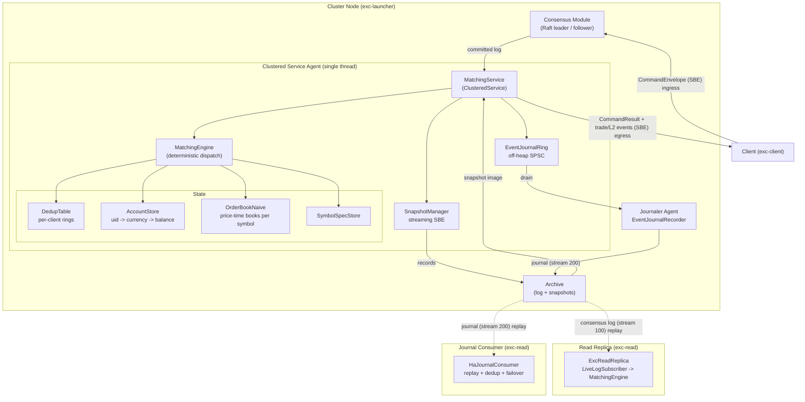

# excoredum - Aeron-Hosted Spot Matching Engine

A deterministic, replicated, in-memory spot exchange matching engine in Java,
built on Aeron Cluster. It re-hosts the exchange-core matching model as a single
Aeron `ClusteredService`: strong consistency, ultra-low latency, and an
allocation-free hot path for a core order book and its balances.

## Overview

excoredum is a strongly consistent order-matching engine for low-latency,
high-throughput workloads. It runs as one Aeron `ClusteredService` replicated by
Raft and does exactly one thing well: execute deterministic state transitions
over an order book and its account balances. Every command is idempotent, every
result is byte-reproducible across nodes, and the steady-state hot path allocates
nothing.

It ports the matching semantics of exchange-core (price-time priority, GTC / IOC
/ FOK-BUDGET orders, direct-exchange spot risk with maker / taker fees) onto the
Aeron ecosystem, replacing exchange-core's bespoke disk journal and Chronicle-Wire
snapshots with the Aeron consensus log, native cluster snapshots, and a
highly-available domain event journal on the Aeron Archive.

## Features

- **Deterministic**: identical input logs produce byte-identical state and
  snapshots across nodes and reruns. No clock, no randomness, no unordered
  iteration in the engine.
- **Idempotent**: a per-client dedup window guarantees every command is applied
  at most once, even across client retries and leader failover.
- **Allocation-Free Hot Path**: zero heap allocation during decode, match,
  settle, and ACK in steady state; resting orders are pooled.
- **Lock-Free Single-Writer**: one clustered-service thread owns all state; no
  locks, no contention.
- **Integer-Only Money Math**: 64-bit fixed-scale amounts with overflow-checked
  arithmetic; no floating point anywhere in the matching or settlement path.
- **Price-Time Matching**: a naive order book with strict price-time priority for
  GTC, IOC, and FOK-BUDGET orders, plus PLACE / CANCEL / MOVE / REDUCE.
- **Direct-Exchange Risk with Fees**: funds are reserved on placement, settled at
  the actual fill price with maker / taker fees accruing to a fee account, and
  released on cancel / reduce, with value conserved across every trade including
  fees (no margin in this delivery).
- **User Lifecycle**: accounts can be suspended and resumed; a suspended user is
  blocked from placing new orders while its balances stay intact.
- **Native Snapshots**: engine state (symbols, accounts, resting orders, dedup)
  is streamed to the Archive in deterministic key order with an integrity
  checksum; recovery loads the snapshot and replays the remaining log.
- **Fault-Tolerant Failover**: a multi-node Raft cluster elects a leader and
  catches up on restart; in-flight commands are retried idempotently across
  leader changes with no double-apply.
- **SBE Wire Format**: fixed little-endian binary layout, no reflection,
  backward-compatible schema evolution via optional fields.
- **CQRS Read Replica**: `exc-read` runs a non-voting node that follows a cluster
  member's Aeron Archive and reproduces engine state for eventually-consistent
  reads, without joining Raft or affecting quorum.
- **HA Domain Event Journal**: every node records a durable, semantic stream of
  trade / reduce / reject events to the Aeron Archive off the consensus thread;
  consumers replay it and dedup on `(logPosition, eventIndex)` for exactly-once
  delivery that survives a leader kill and follows a live source across failover.
- **Off-Heap Telemetry**: core counters are mirrored to a standalone off-heap
  `CountersManager` so operators can read them from another thread without
  perturbing the single-writer hot path.

> Requires JDK 21 and Linux. Aeron/Agrona need the JVM flags
> `--add-opens java.base/jdk.internal.misc=ALL-UNNAMED` and
> `--add-opens java.base/sun.nio.ch=ALL-UNNAMED` (the launcher and read modules
> set these automatically).

## Requirements

- JDK 21 (LTS). The Gradle toolchain enforces language level 21.
- Linux (Aeron's default media driver targets Linux).
- Built on Aeron 1.48, Agrona 2.2, Simple Binary Encoding 1.35.

## Build

excoredum is a Gradle multi-module project. Build it from source:

```bash
git clone <repo-url> excoredum && cd excoredum
./gradlew build
```

To embed the engine in another Gradle build, depend on the core module (or on
`exc-client` for the client-side SDK, which links only the wire contract):

```kotlin
dependencies {
    implementation(project(":exc-core"))    // deterministic matching engine
    implementation(project(":exc-client"))  // client-side SDK (protocol only)
}
```

## Quick Start

### Drive a single-node cluster with the client SDK

`exc-client` is the client-side SDK. It depends only on the `exc-protocol` wire
contract (never on `exc-core`) and handles leader changes, idempotent retry,
result correlation, and egress event delivery. This snippet boots an in-process
single-node cluster, funds a maker and a taker, and crosses an order to produce a
trade:

```java
import com.exadbe.client.ExcClient;
import com.exadbe.client.config.ClientConfig;
import com.exadbe.config.CoreConfig;
import com.exadbe.launcher.ClusterConfig;
import com.exadbe.launcher.ClusterNode;

int sym = 1, base = 10, quote = 20;
long maker = 1L, taker = 2L;

try (ClusterNode node = new ClusterNode(ClusterConfig.singleNodeLocalhost(0, baseDir), CoreConfig.defaults())) {
    ClientConfig config = ClientConfig.builder(1L, ClusterConfig.ingressEndpoints(1)).build();

    try (ExcClient client = new ExcClient(config,
            (idHi, idLo, code, uid, hasUid, orderId, hasOrderId, filledSize, hasFilledSize) ->
                System.out.println("result " + code + (hasFilledSize ? " filled=" + filledSize : "")))) {

        client.tradeListener((idHi, idLo, index, symbolId, makerOrderId, makerUid, takerUid, price, size, done) ->
            System.out.println("TRADE price=" + price + " size=" + size));

        client.addSymbol(sym, base, quote, 1L, 1L);   // baseScaleK = quoteScaleK = 1
        client.addUser(maker);
        client.adjustBalance(maker, base, 1_000L);      // maker funds base to sell
        client.addUser(taker);
        client.adjustBalance(taker, quote, 1_000_000L); // taker funds quote to buy

        client.placeGtc(sym, 1L, /* ask */ true, 100L, 10L, 0L, maker);   // resting ask @100 x10
        client.placeGtc(sym, 2L, /* bid */ false, 105L, 6L, 105L, taker); // crosses, fills 6 @100

        for (int i = 0; i < 100_000 && client.pendingCount() > 0; i++) {
            client.poll(); // drives egress delivery, event decode, and idempotent retransmission
        }
    }
}
```

Resubmitting the same `clientId` and `clientSeq` returns the cached result and
does not re-apply the command.

### Drive the engine directly (no cluster)

`MatchingEngine` has no Aeron dependency, so it can be driven straight from a
decoded `CommandEnvelope`, exactly as the unit tests do:

```java
MatchingEngine engine = new MatchingEngine(CoreConfig.defaults(), new CoreMetrics());
CommandOutcome outcome = new CommandOutcome();
boolean duplicate = engine.process(commandDecoder, /* leader timestamp */ 1_000L, outcome);
System.out.println(outcome.resultCode()); // e.g. SUCCESS
```

### Run a cluster node

```bash
# Single-node localhost cluster
./gradlew :exc-launcher:run

# Node 1 of a multi-node cluster, preserving prior state across restarts
./gradlew :exc-launcher:run -Dexc.nodeId=1 -Dexc.cleanStart=false

# From a deployment properties file (must define exc.clusterMembers)
./gradlew :exc-launcher:run --args="--config=production.properties"
```

### Run a read replica

```bash
./gradlew :exc-read:run --args="--archive=aeron:udp?endpoint=localhost:20104"
```

## How It Works

excoredum is a replicated state machine. Commands flow through Aeron Cluster and
arrive at `MatchingService` in total order on a single thread:

1. **Dispatch**: `onSessionMessage` decodes the SBE envelope. The dedup table is
   checked first; a hit returns the cached result verbatim. A miss dispatches to
   the engine (add symbol / add user / balance adjustment / suspend / resume user /
   place / cancel / move / reduce / order-book request / reset / nop).
2. **Match and settle**: order commands run against the per-symbol order book with
   price-time priority. Funds are reserved before matching, settled at the actual
   fill price, and any over-reserve released. Trades, reduces, and rejects are
   recorded into a reusable outcome buffer.
3. **Idempotency**: because `clientSeq` is monotonic per client, its dedup slot is
   `seq & (capacity - 1)`, so lookup and store are O(1) and allocation-free.
4. **ACK and events**: the result is encoded as an SBE `CommandResult` carrying
   the original `commandId`; trade / reduce / reject events and (for an order-book
   request) an `L2MarketData` frame are offered to egress.
5. **Snapshot and recovery**: on a controlled trigger, state is streamed to the
   Archive in deterministic key order (including the dedup table). On restart the
   snapshot is loaded and the remaining log is replayed.
6. **Domain event journal**: on every node, committed trade / reduce / reject
   events are encoded into an off-heap ring and drained by a journaler agent to a
   recorded Aeron stream, off the consensus thread. Consumers replay it and dedup
   on `(logPosition, eventIndex)` for exactly-once delivery that survives a leader
   loss.

The business logic lives in `MatchingEngine`, which has no Aeron dependency and
is therefore unit and replay testable in isolation.

## Configuration

Capacities are preallocated and validated in `CoreConfig`; power-of-two where
they index a ring:

| Setting                 | Default | Purpose                                   |
|-------------------------|---------|-------------------------------------------|
| `accountCapacity`       | 2^16    | Preallocated account-map slots            |
| `dedupClientCapacity`   | 2^12    | Preallocated dedup clients                |
| `dedupWindow`           | 2^10    | Most recent commands retained per client  |
| `orderPoolCapacity`     | 2^16    | Retained free order nodes (reuse pool)    |
| `priceBucketCapacity`   | 2^13    | Retained free price levels (bucket pool)  |
| `eventBufferCapacity`   | 2^10    | Preallocated matcher events per command   |
| `journalSlotCount`      | 2^16    | Domain-event ring slots (power of two)    |
| `journalSlotSize`       | 128     | Bytes per journal ring slot               |
| `l2MaxLevels`           | 32      | Max L2 depth returned per side            |

`ClusterConfig` describes node id, cluster members, directories, and channels:
`singleNodeLocalhost` for local runs and integration tests, `multiNodeLocalhost`
for an in-process multi-node cluster, and `fromProperties` to load a node from a
deployment properties file (`exc.clusterMembers`, `exc.baseDir`, `exc.host`).

## Observability

Core counters are mirrored to a standalone off-heap `CountersManager` allocated by
`ClusterNode`, so an operator can read them from another thread without touching
the single-writer hot path. Counters include commands processed, duplicates,
backpressure, unsupported commands, snapshots taken / loaded, event-buffer
overflows, and order-pool exhaustions; gauges record snapshot write / read time.
The hot path only increments a counter - no string formatting, no allocation.

## Architecture



| Module         | Responsibility                                                            |
|----------------|---------------------------------------------------------------------------|
| `exc-protocol` | SBE schema and generated flyweight codecs (wire, egress events, snapshot) |
| `exc-core`     | Deterministic matching engine, order book, risk, dedup, snapshot, telemetry |
| `exc-launcher` | Aeron bootstrap: Media Driver, Archive, Consensus, Container, journaler agent |
| `exc-client`   | Client-side SDK: leader-change handling, idempotent retry, correlation, events |
| `exc-read`     | CQRS read side and journal consumers: log follower, replay, dedup, HA failover |
| `exc-bench`    | End-to-end latency harness (in-process cluster + client, HdrHistogram)     |
| `exc-xcore-bench` | Comparative benchmarks vs exchange-core 0.5.3 (replay parity, latency, JMH) |
| `exc-tests`    | Unit, property, integration, cluster, fault tests and fixtures            |
| `exc-examples` | Placeholder for runnable examples                                        |

See [docs/ARCHITECTURE.md](docs/ARCHITECTURE.md) for the component map, wire and
snapshot formats, data flows, determinism rules, and order-book semantics.

## Performance

Indicative micro-benchmark results on x86_64 Linux, JDK 21 (JMH quick run):

| Operation                         | Time     | Notes                                 |
|-----------------------------------|----------|---------------------------------------|
| Envelope decode                   | ~1.9 ns  | SBE flyweight wrap plus field reads   |
| Envelope encode                   | ~3.8 ns  | SBE flyweight write                   |
| IOC match (1 fill vs deep book)   | ~6.3 ns  | price-time matching loop              |
| Resting place + cancel            | ~22.9 ns | pooled book insert and remove         |
| Full dispatch (place + cancel)    | ~86 ns   | dedup, symbol/user checks, risk, book |
| Journal emit (4 events + drain)   | ~46 ns   | off-heap ring, zero-alloc producer    |

Run with the GC profiler to confirm zero steady-state allocation:

```bash
./gradlew :exc-core:jmh -Pjmh.profilers=gc
```

Performance targets (defaults; tune per service):

- Small message decode: < 100 ns (met)
- Primitive map lookup: < 50 ns (met)
- Steady-state allocation on the hot path: zero
- Tail latency, not mean, is the contract: p99.99 governs.

## Testing

```bash
# Unit and property tests
./gradlew test

# Integration tests (in-process single-node cluster)
./gradlew integrationTest

# Multi-node and fault-injection suites (also wired into the default check gate)
./gradlew clusterTest   # warm restart from a native snapshot
./gradlew faultTest     # kill the leader mid-flight, verify exactly-once failover
./gradlew soakTest      # sustained load (opt-in)

# Full local gate: format, lint, compile with warnings-as-errors, all tests
./gradlew spotlessApply checkstyleMain checkstyleTest compileJava test integrationTest
```

| Suite                              | Type        | What it covers                                          |
|------------------------------------|-------------|---------------------------------------------------------|
| `MatchingEngineTest`               | Unit        | Dedup, account handlers, suspend / resume, result codes |
| `OrderBookConformanceTest`         | Unit        | GTC / IOC / FOK-BUDGET, cancel / move / reduce, L2      |
| `SpotRiskTest`                     | Unit        | Reserve / settle / release, value conservation          |
| `FeeTest`                          | Unit        | Maker / taker fees, fee account, conservation with fees |
| `EventJournalTest`                 | Unit        | Journal ring order / back-pressure, encoding, dedup     |
| `EngineDeterminismTest`            | Property    | Replay determinism and sum-of-deltas (jqwik)            |
| `SnapshotRoundTripTest`            | Unit        | Byte-identical snapshot round trip and checksum         |
| `SnapshotIntegrityTest`            | Unit        | Truncation and corruption are rejected                  |
| `HotPathHardeningTest`             | Unit        | Node pooling, bounded event buffer, off-heap counters   |
| `ExcClientIntegrationTest`         | Integration | Client submit / poll, command-id correlation            |
| `ExcAccountsIntegrationTest`       | Integration | Account lifecycle result codes end to end               |
| `ExcOrderBookIntegrationTest`      | Integration | Resting maker matched by taker, trade on egress         |
| `BenchHarnessSmokeTest`            | Integration | End-to-end latency harness boots and measures           |
| `ReadReplicaIntegrationTest`       | Integration | Replica reproduces users, balances, resting depth       |
| `JournalClusterIntegrationTest`    | Integration | A committed trade reaches the recorded journal stream   |
| `JournalReplayIntegrationTest`     | Integration | Archive replay decodes trades; repeated replay dedups   |
| `SnapshotWarmRestartIntegrationTest` | Cluster   | Warm restart recovers state from a native snapshot      |
| `LeaderKillFailoverTest`           | Fault       | Three-node leader kill; exactly-once, no loss or dup    |
| `JournalHaFailoverTest`            | Fault       | Journal survives a leader kill; trades exactly-once     |
| `JournalLiveFailoverTest`          | Fault       | Live consumer fails over to a survivor without loss     |

## Benchmarks

```bash
./gradlew :exc-core:jmh                 # full run
./gradlew :exc-core:jmh -PquickBench    # fast smoke run (CI gate)
```

The `exc-bench` module additionally drives an in-process cluster with the client
in a closed loop and reports HdrHistogram round-trip tail latency:

```bash
./gradlew :exc-bench:run --args="--warmup=5000 --ops=20000"
```

### Comparison with exchange-core

The `exc-xcore-bench` module benchmarks excoredum against the upstream
exchange-core 0.5.3 it ports: a matching-level replay of exchange-core's own
deterministic workload generator (with built-in cross-validation that both
engines produce identical trades and L2), single-thread engine dispatch vs the
exchange-core disruptor pipeline, cluster end-to-end vs pipeline end-to-end,
and a JMH comparison of all three order-book implementations.

```bash
./gradlew :exc-xcore-bench:run --args="--mode=book --commands=100000"
./gradlew :exc-xcore-bench:run --args="--mode=engine --warmup=5000 --ops=20000"
./gradlew :exc-xcore-bench:run --args="--mode=e2e --warmup=5000 --ops=20000"
./gradlew :exc-xcore-bench:jmh -PquickBench
```

See [docs/BENCHMARKING-XCORE.md](docs/BENCHMARKING-XCORE.md) for methodology and
fairness notes.

## License

MIT License.

## Credits

Built on the Aeron ecosystem and its design principles:

- [Aeron](https://github.com/aeron-io/aeron) - reliable transport, archive, and cluster
- [Agrona](https://github.com/aeron-io/agrona) - primitive collections and off-heap buffers
- [Simple Binary Encoding](https://github.com/aeron-io/simple-binary-encoding) - zero-copy wire format
- [exchange-core](https://github.com/exchange-core/exchange-core) - the matching-engine model this project ports
