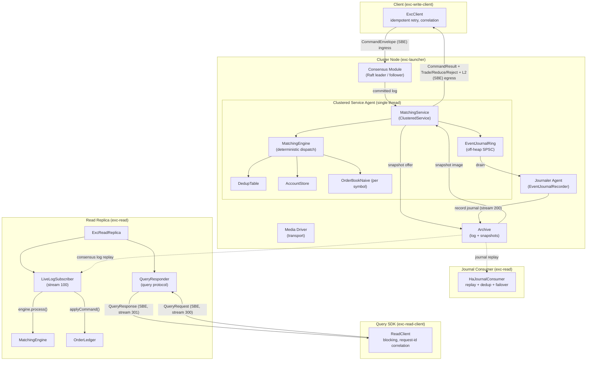
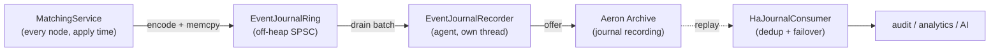
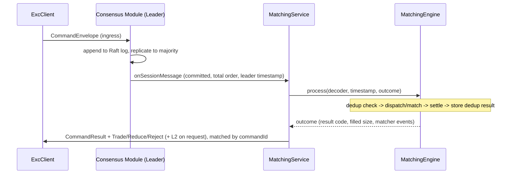
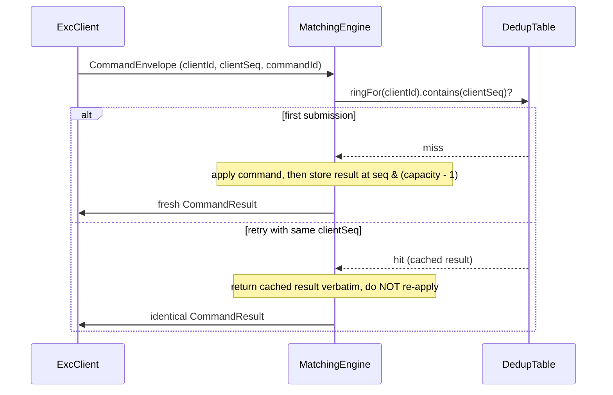
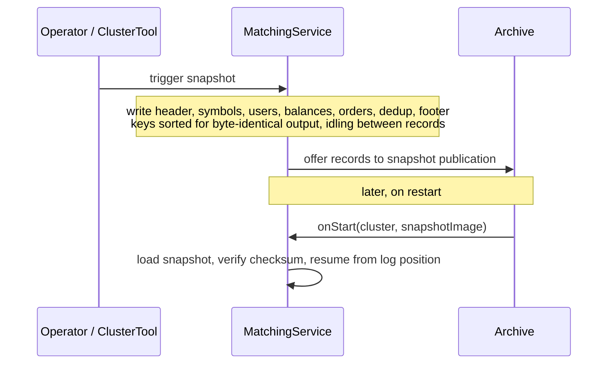
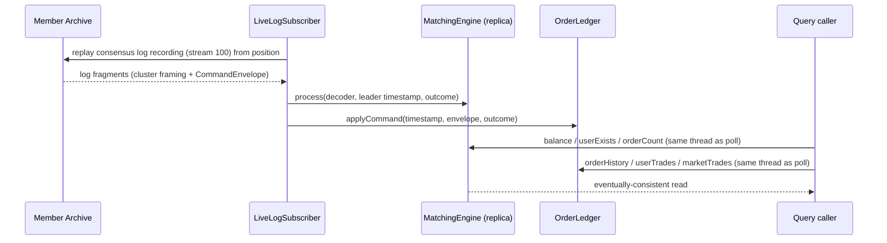
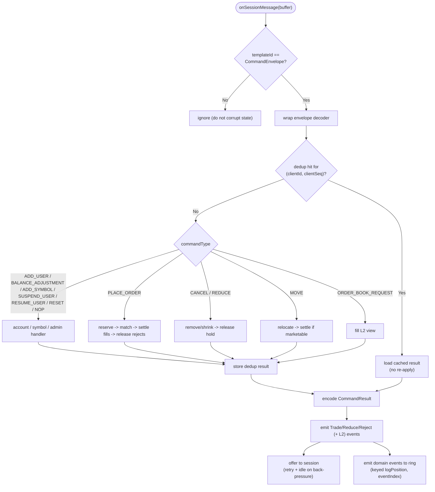
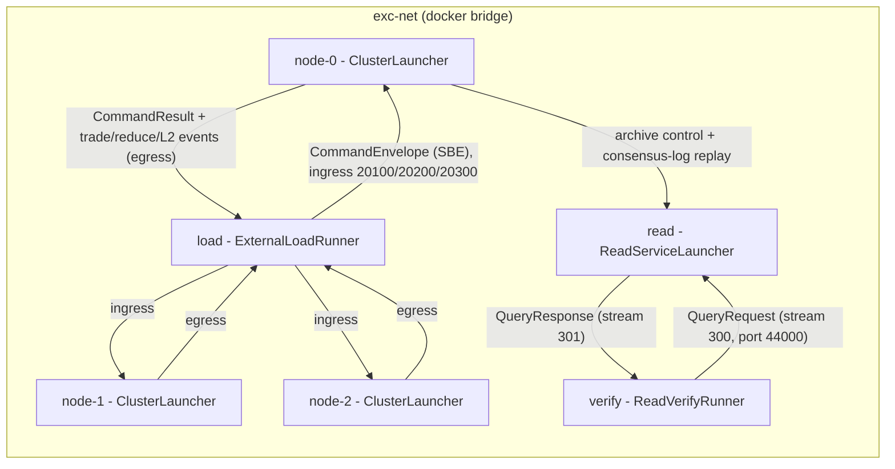

# Architecture

> **Deterministic, replicated, in-memory spot matching engine built on Aeron
> Cluster, targeting strong consistency and ultra-low latency.**

---

## Table of Contents

- [Overview](#overview)
- [Workspace Layout](#workspace-layout)
- [System Diagram](#system-diagram)
- [Module Structure](#module-structure)
    - [exc-protocol - Wire and Snapshot Codecs](#exc-protocol---wire-and-snapshot-codecs)
    - [exc-core - Deterministic State Machine](#exc-core---deterministic-state-machine)
    - [exc-launcher - Cluster Bootstrap](#exc-launcher---cluster-bootstrap)
    - [exc-write-client - Write-side Client SDK](#exc-write-client---write-side-client-sdk)
    - [exc-read - Read Replica (CQRS)](#exc-read---read-replica-cqrs)
    - [exc-read-client - Read-Side SDK](#exc-read-client---read-side-sdk)
    - [exc-bench - Latency Harness](#exc-bench---latency-harness)
    - [exc-xcore-bench - exchange-core Comparison](#exc-xcore-bench---exchange-core-comparison)
    - [exc-examples - Runnable Examples](#exc-examples---runnable-examples)
    - [exc-tests - Verification and Fixtures](#exc-tests---verification-and-fixtures)
- [Wire Format](#wire-format)
- [Order Book Semantics](#order-book-semantics)
- [Direct-Exchange Risk](#direct-exchange-risk)
- [Domain Event Journal](#domain-event-journal)
- [Data Flows](#data-flows)
    - [Flow 1 - Command Dispatch and ACK](#flow-1---command-dispatch-and-ack)
    - [Flow 2 - Idempotent Retry](#flow-2---idempotent-retry)
    - [Flow 3 - Snapshot and Recovery](#flow-3---snapshot-and-recovery)
    - [Flow 4 - Read Replica Following](#flow-4---read-replica-following)
- [Command Processing Pipeline](#command-processing-pipeline)
- [Determinism Rules](#determinism-rules)
- [Snapshot Format](#snapshot-format)
- [Configuration](#configuration)
- [Telemetry](#telemetry)
- [Test Coverage](#test-coverage)
- [Build and Run](#build-and-run)

---

## Overview

excoredum is the single source of truth for a spot order book and the account
balances that back it. It runs as one Aeron `ClusteredService` replicated by
Raft, and does exactly one thing: execute deterministic state transitions over
the order book and account state.

Two concerns, strictly separated:

- **Business logic** (`MatchingEngine`) - pure, single-writer, allocation-free,
  free of any Aeron dependency so it can be unit and replay tested in isolation.
- **Cluster integration** (`MatchingService`) - decodes session messages, drives
  the engine, encodes results and trade / L2 events to egress, emits domain events
  to the journal, and handles snapshot read and write.

Everything the engine needs arrives through the replicated log. There is no
external I/O, no local clock, and no random or GUID generation in the state
machine. Identifiers are minted by the client and carried in the command
envelope; the only time source is the leader-assigned timestamp.

This delivery covers the direct-exchange (spot) risk mode with maker / taker fees,
order types GTC / IOC / FOK-BUDGET, order operations PLACE / CANCEL / MOVE /
REDUCE, account operations ADD_USER / BALANCE_ADJUSTMENT / ADD_SYMBOL /
SUSPEND_USER / RESUME_USER, the RESET / NOP admin commands, a network query
protocol for read replicas (`QueryRequest` / `QueryResponse`, schema version 4),
and a highly-available domain event journal on the Aeron Archive. Margin trading
and symbol / user sharding are out of scope for now.

---

## Workspace Layout

```
excoredum/
|-- settings.gradle.kts             Gradle multi-module (10 modules)
|-- build.gradle.kts                Shared conventions: JDK 21, spotless, checkstyle, -Werror
|-- gradle/libs.versions.toml       Version catalog (Aeron, Agrona, SBE, JMH, HdrHistogram, ...)
|-- config/checkstyle/checkstyle.xml        Baseline style rules for all modules
|
|-- exc-protocol/                   SBE schema + generated flyweight codecs
|   |-- src/main/resources/messages.xml     CommandEnvelope, CommandResult, egress events, JournalEvent, query + snapshot records
|   +-- src/main/java/com/exadbe/protocol/QueryStreams.java  Default query channels / stream ids (request 300, response 301)
|
|-- exc-core/                       Deterministic state machine (this is the hot path)
|   |-- config/checkstyle/determinism.xml   Bans clocks, randomness, unordered maps, streams, floats
|   |-- src/jmh/java/com/exadbe/bench/       CodecBenchmark, OrderBookBenchmark, MatchingEngineBenchmark, JournalBenchmark
|   +-- src/main/java/com/exadbe/
|       |-- config/CoreConfig.java           Preallocated capacities and tuning knobs
|       |-- util/Amounts.java                Overflow-checked 64-bit arithmetic
|       |-- collections/
|       |   |-- AccountStore.java            uid -> (currency -> balance) + user status, sorted iteration
|       |   |-- DedupTable.java              Per-client dedup rings (idempotency)
|       |   +-- DedupRing.java               Power-of-two ring, seq & (capacity - 1)
|       |-- engine/
|       |   |-- MatchingEngine.java          Dispatch + dedup + settlement (cluster-independent)
|       |   |-- handlers/                     AddUser, BalanceAdjustment, AddSymbol, SuspendUser, ResumeUser
|       |   |-- orderbook/                    OrderBookNaive, OrderBookSide, PriceBucket(+Pool), OrderNode(+Pool), L2View
|       |   +-- risk/                         SymbolSpec(+Store), DirectExchangeRisk (fees + fee account)
|       |-- core/
|       |   |-- MatchingService.java         ClusteredService: decode, apply, ACK, emit events + journal, snapshot
|       |   +-- CommandOutcome.java           Reusable result + matcher-event buffer (no per-command allocation)
|       |-- journal/
|       |   |-- EventJournalRing.java         Off-heap SPSC ring for domain events (zero-alloc producer)
|       |   |-- DomainEventJournal.java       Encodes matcher events into the ring, keyed (logPosition, eventIndex)
|       |   |-- JournalDedup.java             Consumer-side exactly-once gate
|       |   +-- JournalStreams.java           Journal channel / stream id constants
|       |-- snapshot/SnapshotManager.java    Streaming SBE snapshot write / load with checksum
|       +-- telemetry/
|           |-- CoreMetrics.java             Single-writer counters mirrored to a sink
|           |-- CounterSink.java             Allocation-free counter sink interface (NOOP default)
|           +-- AtomicCounterSink.java       Off-heap AtomicCounter-backed sink for cross-thread reads
|
|-- exc-launcher/                   Aeron component bootstrap
|   +-- src/main/java/com/exadbe/launcher/
|       |-- ClusterConfig.java              Endpoints and directories per node
|       |-- ClusterNode.java                Media Driver + Archive + Consensus + Container + counters + journaler
|       |-- EventJournalRecorder.java       Agent: drains the journal ring to a recorded Aeron stream
|       +-- ClusterLauncher.java            main(): start one node, block until terminated
|
|-- exc-write-client/                 Write-side client SDK (depends only on exc-protocol)
|   +-- src/main/java/com/exadbe/write/client/
|       |-- ExcClient.java                  Async submit / poll, leader-change resend, correlation, event decode
|       |-- config/ClientConfig.java        Immutable client configuration (builder)
|       |-- ResultHandler.java              Result callback correlated by command id
|       |-- TradeEventListener.java         Trade-event callback
|       |-- ReduceEventListener.java        Reduce-event callback
|       |-- RejectEventListener.java        Reject-event callback
|       |-- OrderBookListener.java          L2 snapshot callback
|       |-- OrderBookSnapshot.java          Reusable holder for one L2 snapshot
|       |-- TradeGroupListener.java         Per-command grouped-fills callback
|       |-- TradeGroup.java                 Reusable holder for one command's fills
|       |-- PendingCommand.java             Pooled in-flight command bytes for verbatim resend
|       +-- BackpressureException.java      Signals a full in-flight window
|
|-- exc-read/                       Read replica (CQRS query side)
|   +-- src/main/java/com/exadbe/read/
|       |-- ExcReadReplica.java             Poll-driven follower: own driver + archive client + engine
|       |-- LiveLogSubscriber.java          Replays the consensus log, applies commands to the engine and the ledger
|       |-- order/
|       |   |-- OrderLedger.java            Per-user order lifecycle history + bounded market trade tape
|       |   |-- OrderRecord.java            One order's lifecycle record (state, fills, timestamps)
|       |   +-- Fill.java / MarketTrade.java  Read-side fill and trade result holders
|       |-- report/
|       |   |-- ReportGenerator.java        Single-user, conservation-total, and state-hash reports
|       |   +-- SingleUserReport.java / TotalCurrencyBalance.java  Report result holders
|       |-- QueryResponder.java             Serves QueryRequest frames on the replica's poll thread
|       |-- ReplicaCommandListener.java     Per-command callback for real-time market event push
|       |-- JournalConsumer.java            Decodes a journal stream, dedups to exactly-once
|       |-- JournalReplayReader.java        Replays a member's recorded journal from the Archive
|       |-- HaJournalConsumer.java          Live journal follower with multi-archive failover
|       |-- ReadStreams.java                Consensus log / replay stream id constants
|       |-- ReplicationHealth.java          Health and applied position published for readers
|       |-- config/ReadReplicaConfig.java   Archive control channel, stream id, local host
|       +-- ReadServiceLauncher.java        Entry point: follow a member archive
|
|-- exc-read-client/               Read-side SDK (depends only on exc-protocol)
|   +-- src/main/java/com/exadbe/read/client/
|       |-- ReadClient.java                Sync wrappers + async submit / poll / listener core
|       |-- QueryListener.java             Async result callbacks (one per query type)
|       |-- config/ReadClientConfig.java   Request / response channels, timing, in-flight window
|       |-- BalanceResult.java / L2Snapshot.java / UserReport.java    Query result holders
|       |-- OrderRecordResult.java / MarketTradeResult.java / TotalBalanceResult.java
|       |-- OrderState.java                Order lifecycle state names
|       +-- BackpressureException.java / QueryTimeoutException.java / QueryException.java
|
|-- exc-bench/                      End-to-end latency harness
|   +-- src/main/java/com/exadbe/bench/
|       |-- ExcBenchHarness.java            Boots a cluster + client, closed-loop HdrHistogram latency
|       +-- LatencyResult.java              Throughput + percentile record
|
|-- exc-xcore-bench/                Comparative benchmarks vs exchange-core 0.5.3
|   |-- src/main/java/com/exadbe/xcorebench/
|   |   |-- WorkloadGenerator.java          Deterministic port of exchange-core's TestOrdersGenerator
|   |   |-- Workload.java                   Replayable command sequence as primitive arrays
|   |   |-- ExcBookRunner.java              Replay through OrderBookNaive (reference)
|   |   |-- XcoreBookRunner.java            Replay through OrderBookNaiveImpl / OrderBookDirectImpl
|   |   |-- BookStats.java                  Event counters + full-depth L2 digest for cross-validation
|   |   |-- ExcEngineRunner.java            Closed-loop full-dispatch latency (decode + dedup + risk + match)
|   |   |-- XcorePipelineRunner.java        Closed-loop ExchangeCore disruptor pipeline latency
|   |   |-- BookComparison.java             book mode: replay throughput + parity check
|   |   |-- EngineComparison.java           engine mode: dispatch vs pipeline tables
|   |   |-- E2eComparison.java              e2e mode: cluster vs pipeline tables (reuses exc-bench)
|   |   +-- XcoreBenchMain.java             CLI (--mode=book|engine|e2e|all)
|   +-- src/jmh/java/com/exadbe/xcorebench/
|       +-- OrderBookComparisonBenchmark.java  JMH: 3 impls x place/cancel, IOC match, replay chunk
|
|-- exc-examples/                   Runnable examples (in-process cluster + client SDK)
|   +-- src/main/java/com/exadbe/examples/
|       +-- QuickStartExample.java      Boots a node, funds users, crosses orders, shows all egress events
|
+-- exc-tests/                      Unit, property, integration, cluster, fault tests
    |-- src/testFixtures/java/com/exadbe/testkit/InMemorySnapshot.java   Snapshot to/from an in-memory buffer
    +-- src/test/java/com/exadbe/            Test suites (see Test Coverage)
```

---

## System Diagram



A node's components communicate over IPC. The `ClusteredServiceAgent` receives
the committed log, so every command reaches `MatchingService` in total order on a
single thread. The read replica runs its own media driver and follows a member's
Archive over UDP, never joining consensus. The query SDK talks to a read
replica's `QueryResponder` over plain Aeron UDP request/response streams
(stream 300 request, 301 response by default), so internal services can read
replicated state without joining the replica's process.

---

## Module Structure

### exc-protocol - Wire and Snapshot Codecs

A dependency-only module (no dependency on `exc-core`) holding the SBE schema and
the generated flyweight codecs. SBE produces type-safe encoders and decoders that
operate directly on buffers, with no reflection and no intermediate objects.
Little-endian, fixed field order.

| Message            | Template Id | Purpose                                              |
|--------------------|-------------|------------------------------------------------------|
| `CommandEnvelope`  | 1           | Command submitted by a client (order or account op)  |
| `CommandResult`    | 2           | Exactly one deterministic result per command         |
| `TradeEvent`       | 20          | One fill against a resting maker order               |
| `ReduceEvent`      | 21          | A resting order was reduced or cancelled             |
| `RejectEvent`      | 22          | Unmatched size rejected (IOC / FOK / duplicate id)   |
| `L2MarketData`     | 30          | L2 order-book snapshot for an order-book request      |
| `JournalEvent`     | 40          | One durable domain event (audit / AI journal stream) |
| `QueryRequest`     | 60          | Read-side query (since schema version 4)            |
| `QueryResponse`    | 61          | Read-side query result (since schema version 4)     |
| `SnapshotHeader`   | 100         | First snapshot record: log position and counts       |
| `SymbolSpecRecord` | 101         | One symbol spec (ascending symbolId)                 |
| `UserRecord`       | 102         | One account existence marker (ascending uid)         |
| `BalanceRecord`    | 103         | One balance entry (ascending uid, currency)          |
| `OrderRecord`      | 104         | One resting order (book order, best-first FIFO)      |
| `DedupRecord`      | 105         | One cached result (ascending clientId, clientSeq)    |
| `SnapshotFooter`   | 199         | Terminal record with an integrity checksum           |

Optional fields (`presence="optional"`) carry order and account operands that are
absent for other command types, and prepare the schema for backward-compatible
evolution. Fee and user-status fields were added at schema version 2 with
`sinceVersion`, so a version-1 snapshot still loads (missing fields default to
zero fee / active). Schema version 3 added `CommandResult.eventCount` (the number
of matcher-event frames that follow the result; zero on duplicate re-sends, L2
not counted), `ReduceEvent.price` / `ReduceEvent.orderCompleted` (resting price;
whether the order was fully removed), and `RejectEvent.price` (the active order
price, or the budget for FOK-BUDGET). Schema version 4 added the read-side query
protocol: `QueryRequest` (id 60) and `QueryResponse` (id 61) with the `QueryType`
and `QueryStatusCode` enums, plus `QueryResponse.history.placedTimestamp`.
Enums: `OrderCommandType`, `OrderAction`, `OrderType`, `MatcherEventType`,
`CommandResultCode`, `QueryType`, `QueryStatusCode`.

### exc-core - Deterministic State Machine

The allocation-conscious heart of the engine. `MatchingEngine` is deliberately
free of Aeron so it runs in tests; `MatchingService` adapts it to the cluster.

| Component           | Responsibility                                                          |
|---------------------|-------------------------------------------------------------------------|
| `MatchingService`   | ClusteredService callbacks: decode, dispatch, ACK, emit events, snapshot |
| `MatchingEngine`    | Idempotent dispatch, matching orchestration, and settlement (single-writer) |
| `CommandOutcome`    | Reusable result holder plus a bounded matcher-event buffer               |
| `AddUserHandler`    | Create an account                                                        |
| `BalanceAdjustmentHandler` | Signed balance adjustment, overflow-checked                      |
| `AddSymbolHandler`  | Register a symbol spec (base / quote currency, scales, maker / taker fees) |
| `SuspendUserHandler` / `ResumeUserHandler` | Block / re-enable a user's order placement       |
| `OrderBookNaive`    | Per-symbol price-time order book: place, match, cancel, move, reduce, L2 |
| `OrderBookSide`     | One side as a best-first linked list of price buckets plus a price map   |
| `PriceBucket` / `PriceBucketPool` | A FIFO queue of resting orders at one price, and its reuse pool |
| `OrderNode` / `OrderNodePool` | Intrusive resting-order node and its reuse pool                |
| `DirectExchangeRisk`| Reserve / release / settle funds and fees; fee account (uid 0)           |
| `SymbolSpecStore`   | Symbol specs keyed by symbolId, sorted iteration for snapshots           |
| `AccountStore`      | `uid -> (currency -> balance)` plus user status, sorted iteration        |
| `DedupTable` / `DedupRing` | Per-client rings, O(1) idempotency within the dedup window        |
| `EventJournalRing` / `DomainEventJournal` | Off-heap ring and encoder for the domain event journal |
| `JournalDedup`      | Consumer-side exactly-once gate on `(logPosition, eventIndex)`            |
| `SnapshotManager`   | Streaming SBE snapshot writer / loader with deterministic key ordering   |
| `CoreMetrics` / `CounterSink` / `AtomicCounterSink` | Single-writer counters, off-heap mirror      |

### exc-launcher - Cluster Bootstrap

Launches and owns the Aeron components for one node and hosts a single
`MatchingService`. Internal components reach the Archive over an IPC local-control
channel; the Archive also exposes a UDP control channel for external tools and the
read replica.

| Component        | Responsibility                                                        |
|------------------|-----------------------------------------------------------------------|
| `ClusterConfig`  | Endpoints and directories; `singleNodeLocalhost`, `multiNodeLocalhost`, `fromMembers`, `fromProperties` |
| `ClusterNode`    | Launches Media Driver + Archive + Consensus Module + Container; allocates the off-heap `CountersManager`; starts recording the domain journal and runs the journaler agent |
| `EventJournalRecorder` | Agent draining the service's journal ring to a recorded Aeron stream, off the consensus thread |
| `ClusterLauncher`| Entry point: start a node (single-node or `--config` / `-Dexc.config` properties) and block until terminated |

### exc-write-client - Write-side Client SDK

The write-side client SDK. It depends only on the `exc-protocol` wire contract, never on
`exc-core`. It adds leader-change handling, idempotent retry (reusing the original
`commandId`), asynchronous request / response correlation, explicit backpressure
signalling, and full egress event delivery (trade / reduce / reject frames, L2
snapshots, and per-command trade grouping) on top of an Aeron cluster client.

| Component               | Responsibility                                                    |
|-------------------------|-------------------------------------------------------------------|
| `ExcClient`             | Async submit / poll: resend on leader change, correlate results by command id, decode every egress frame, group fills per command, idle keepalives, session recovery |
| `ClientConfig`          | Immutable client configuration (endpoints, timeouts, retry, in-flight window); defaults: 30 s message timeout, 250 ms retry backoff, `maxRetries` 0 (retry indefinitely), 1024 in flight, 2 s keepalive |
| `ResultHandler`         | Callback invoked when a `CommandResult` correlates to a request; `onExpired` fires when the retry budget is exhausted so no command is silently dropped |
| `TradeEventListener`    | Callback invoked per fill when a `TradeEvent` is delivered on egress |
| `ReduceEventListener`   | Callback invoked when a `ReduceEvent` is delivered on egress       |
| `RejectEventListener`   | Callback invoked when a `RejectEvent` is delivered on egress       |
| `OrderBookListener`     | Callback invoked with an `OrderBookSnapshot` when an `L2MarketData` frame arrives |
| `OrderBookSnapshot`     | Reusable holder for one L2 snapshot (grow-only arrays; copy in the callback to keep) |
| `TradeGroupListener`    | Callback invoked once per command when its fills are complete      |
| `TradeGroup`            | Reusable holder for one command's fills; flushed on `CommandResult.eventCount` completion or a command boundary |
| `PendingCommand`        | Pooled holder of an in-flight command's bytes for verbatim resend  |
| `BackpressureException` | Signals a full in-flight window rather than silently dropping a command |

Typed helpers cover the full command set: `addSymbol`, `addUser`,
`adjustBalance`, `suspendUser`, `resumeUser`, `placeGtc`, `placeIoc`,
`placeFokBudget`, `cancelOrder`, `moveOrder`, `reduceOrder`, `requestOrderBook`.

**Session liveness.** The cluster closes a client session that sends no ingress
for its session timeout (10 s by default), after which every offer fails and
commands silently stop applying. `ExcClient` therefore submits a NOP keepalive
when idle for `keepaliveIntervalNs` (2 s by default, zero disables), and if the
session is lost anyway (cluster restart, egress CLOSED / ERROR event) it
reconnects on a later poll and retransmits everything pending. Keepalives are
filtered out of the result handler and latency histogram. Long-lived boundary
clients must also use a client identity whose `clientSeq` never replays the
cluster's dedup window: a restarted client that reuses a `clientId` with
`clientSeq` starting at zero gets stale cached results instead of fresh applies.
Boundary clients that embed the SDK must derive a per-process unique `clientId`
for this reason.

### exc-read - Read Replica (CQRS)

The read (query) side. Unlike the deterministic core it may use the system clock
and heap allocation. `ExcReadReplica` runs a non-voting node with its own embedded
Media Driver and Aeron Archive client. It connects to a cluster member's Archive
and follows the consensus log recording (stream 100) from the start, applying each
command to a private `MatchingEngine`; engine dedup keeps any re-delivered prefix
idempotent. Reads are eventually consistent with bounded staleness.

It is poll-driven and single-threaded: the caller drives `poll()` and issues reads
from the same thread, so the engine's non-thread-safe stores are only ever touched
by one thread and readers always see a consistent state. A read replica is NOT a
cluster member: it does not vote, does not affect quorum, and can be restarted
independently.

The replica is configured with an ordered list of member archives (see
`ReadReplicaConfig`); the first is the primary source. When the current source
dies, the replica fails over to the next member in order: recording positions are
member-specific, so it clears its engine and ledger and rebuilds its state by
replaying the new source's consensus-log recording from the start, then follows
live. Because reads are eventually consistent, the catch-up window after
failover is part of the read model's contract; `currentSource()` exposes the
member archive currently followed.

The replica also serves the read-side report framework over its private engine
(eventually consistent, no ingress or consensus round trip): `singleUserReport(uid)`
returns a user's status, balances, and resting orders, `totalCurrencyBalance()`
returns the per-currency total of balances plus funds reserved by resting orders,
broken out into client account balances, collected fees, and reserved order
balances (invariant across trades, so it verifies value conservation including
fees on account 0), and `stateHash()` returns a deterministic fingerprint
identical to a snapshot footer checksum for comparing replicas or reconciling
against a snapshot.

On top of the engine, the replica rebuilds an order lifecycle ledger and a market
trade tape directly from the replicated log (`OrderLedger`). Every applied command
updates the ledger on the same polling thread, so the queries below are consistent
with the engine state and identical across replicas and restarts (a replayed log
rebuilds the same history). Per-user order history (`orderHistory(uid)`,
`activeOrders(uid)`, `order(orderId)`) covers every order placed by any client -
not just one client session - with placement fields (price, size, order type,
`userCookie`), a lifecycle state (NEW / ACTIVE / CANCELLED / COMPLETED /
REJECTED), per-fill deals with counterparty, and leader-assigned timestamps.
`userTrades(uid, limit)` and `marketTrades(symbolId, limit)` query the bounded
global trade tape. The ledger is deliberately bounded: each user keeps at most
`OrderLedger.MAX_ORDERS_PER_USER` records (oldest terminal records are evicted)
and the tape holds at most `OrderLedger.MAX_MARKET_TRADES` trades. Re-delivered
commands are skipped by reusing the engine's dedup decision (outcome
`DUPLICATE`), and a replicated RESET clears the ledger.

The replica also serves a network query protocol for internal services.
`QueryResponder` subscribes to `QueryRequest` frames (SBE, default stream 300 on
`aeron:udp?endpoint=localhost:44000`) and answers each from the replica's state
on the same single polling thread, publishing a `QueryResponse` (default stream
301) to the client's ephemeral response subscription named in the request. Every
response carries the `appliedPosition` the replica had reached, so consumers can
judge staleness; an answer that would overflow the preallocated 256 KiB reply
buffer is truncated with status `TRUNCATED` rather than corrupting it, unknown
users / symbols / orders answer `NOT_FOUND`, and response publications are
cached (LRU, up to 64). The `ReadServiceLauncher` wires the responder into the
same poll loop as the replica.

Two poll-thread APIs expose replication progress and command visibility to
embedding services: `isCaughtUp()` distinguishes live following from historical
replay (false while disconnected or replaying), and `setCommandListener`
registers a `ReplicaCommandListener` that fires once per applied command (for
example, to push real-time market events to gateway agents). The envelope and
outcome passed to the listener are reused and only valid during the call.

Replay and source stream ids are distinct: the consensus log is recorded on
stream 100 and replayed on the ephemeral stream 43; the domain journal is
recorded on stream 200 (`aeron:ipc`) and replayed by `JournalReplayReader` on
stream 44 and by `HaJournalConsumer` on stream 45.

| Component           | Responsibility                                                       |
|---------------------|----------------------------------------------------------------------|
| `ExcReadReplica`    | Embedded driver, archive client, engine; `poll()` follows the log; balance / count / report / L2 / order-history queries; `isCaughtUp()` and `setCommandListener(...)` |
| `LiveLogSubscriber` | Subscribes the consensus recording, parses cluster framing, applies commands to the engine and the ledger |
| `ReplicaCommandListener` | Per-command callback fired on the poll thread for every applied command (envelope / outcome reused) |
| `QueryResponder`    | Serves `QueryRequest` frames on the replica's poll thread; publishes `QueryResponse` to each client's subscription |
| `OrderLedger`       | Per-user order lifecycle history, per-order fills, and a bounded market trade tape, rebuilt from the log |
| `OrderRecord` / `Fill` / `MarketTrade` | Read-side result holders for the order-history queries       |
| `ReportGenerator`   | Assembles single-user, total-currency-balance, and state-hash reports over the replica engine |
| `SingleUserReport` / `TotalCurrencyBalance` | Read-side result holders for the report queries      |
| `JournalConsumer`   | Decodes a journal fragment stream and dedups to exactly-once delivery |
| `JournalReplayReader` | Replays a member's recorded journal from the Archive through a `JournalConsumer` |
| `HaJournalConsumer` | Follows one member's journal live and fails over to another on source loss |
| `ReplicationHealth` | Health and applied cluster-global position published for readers     |
| `ReadStreams`       | Consensus log and replay stream id constants                         |
| `ReadReplicaConfig` | Archive control channel, control stream id, query request channel, local host |
| `ReadServiceLauncher`| Entry point: follow a member archive and serve queries             |

### exc-read-client - Read-Side SDK

The read-side SDK, deliberately decoupled like `exc-write-client`: it depends only on
`exc-protocol` (never `exc-core` or `exc-read`). `ReadClient` opens a plain Aeron
publication to a read replica's query request stream and an ephemeral response
subscription, and encodes `QueryRequest` frames with a per-call `requestId`.
Two API modes share one core, mirroring `ExcClient`:

- **Asynchronous**: `submitBalance(uid, currency)`-style methods return a
  `requestId` without blocking (throwing `BackpressureException` when the
  bounded in-flight window is full); `poll()` drives delivery and fires the
  registered `QueryListener` callbacks on the caller's thread; unanswered
  queries are re-published idempotently (same request id) until answered or the
  retry budget is exhausted, then `onTimeout` fires.
- **Synchronous**: `balance(uid, currency)`-style convenience methods submit and
  block (driving `poll()` themselves) until the matching response arrives or
  `messageTimeoutNs` elapses, throwing `QueryTimeoutException`.

Queries are reads, so a retry simply re-publishes the same request id;
responses to abandoned attempts are discarded. Results are eventually
consistent and each carries the replica's `appliedPosition` at answer time.

The query surface mirrors the replica's in-process API: `userExists(uid)`,
`balance(uid, currency)`, `orderBook(symbolId, maxLevels)`,
`singleUserReport(uid)`, `orderHistory(uid)`, `activeOrders(uid)`,
`order(orderId)`, `userTrades(uid, limit)`, `marketTrades(symbolId, limit)`,
`totalCurrencyBalance()`, and `stateHash()` (each also available as
`submit...`).

| Component           | Responsibility                                                       |
|---------------------|----------------------------------------------------------------------|
| `ReadClient`        | Sync wrappers + async `submit` / `poll` / listener core, request-id correlation, idempotent retransmission, bounded in-flight window |
| `QueryListener`     | Async delivery callbacks, one per query type, plus `onTimeout` / `onError` |
| `ReadClientConfig`  | Request / response channels and stream ids, media driver dir, timing, `maxInFlight` |
| Result holders      | `BalanceResult`, `L2Snapshot`, `UserReport`, `OrderRecordResult`, `MarketTradeResult`, `TotalBalanceResult`, `OrderState` |
| `BackpressureException` / `QueryTimeoutException` / `QueryException` | Query failure signalling |

### exc-bench - Latency Harness

End-to-end load drivers (exempt from the core determinism rules):

- `ExcBenchHarness` - the latency harness. It boots an in-process single-node
  cluster and drives it with the real client in a closed loop (one command
  outstanding at a time), recording client-observed round-trip latency in an
  HdrHistogram and reporting tail percentiles. Each measured op is a taker
  order that fully fills one unit against a deep resting maker, so the book
  stays bounded.
- `LoadWorkload` - a deterministic synthetic workload plus an exact simulation
  of the engine's single-price-level FIFO book. It is the shared expectation
  model for the system tests: every decided command (place / cancel / reduce /
  order-book request) is applied to the simulation with the engine's exact
  reserve / settle / release semantics, so the simulation predicts the final
  balances, resting orders, and fill counts. `LoadWorkloadEngineParityTest`
  cross-validates it against the real engine command by command.
- `ExternalLoadRunner` - drives a running (possibly multi-node, possibly
  containerized) cluster over the network: submits the `LoadWorkload` through
  `ExcClient` and verifies the write side (every result `SUCCESS`, nothing
  expired, egress fills equal the simulation), reporting throughput and
  round-trip latency tails.
- `ReadVerifyRunner` - replays the same `LoadWorkload` simulation and asserts
  a read replica's state matches it exactly through `ReadClient` (per-user
  free balances and resting orders, order-history and trade-tape counts, the
  L2 book, and the value-conservation totals).

JMH micro-benchmarks for the hot path live in `exc-core`'s jmh source set.

### exc-xcore-bench - exchange-core Comparison

Comparative benchmarks against upstream exchange-core 0.5.3 (exempt from the
core determinism rules). A faithful port of exchange-core's
`TestOrdersGenerator` produces a deterministic command mix that is replayed
through excoredum's `OrderBookNaive` (reference) and both exchange-core books,
with built-in cross-validation of event counters and full-depth L2. Engine-path
and end-to-end modes measure closed-loop latency through `MatchingEngine.process`
vs the exchange-core disruptor pipeline, and through the full cluster vs the
pipeline. See [BENCHMARKING-XCORE.md](BENCHMARKING-XCORE.md) for methodology and
fairness notes.

### exc-examples - Runnable Examples

`QuickStartExample` boots an in-process single-node cluster (`ClusterNode` +
`ClusterConfig.singleNodeLocalhost` + `CoreConfig.defaults()`) and walks a small
trading scenario through the `ExcClient` SDK, printing every egress surface as
it happens: per-fill trades, per-command trade groups, a reduce, a reject, and
an L2 snapshot. Run with `./gradlew :exc-examples:run`.

### exc-tests - Verification and Fixtures

Unit, property, integration, cluster, and fault tests plus a `testFixtures`
toolkit. `Commands` encodes a `CommandEnvelope` and returns a wrapped decoder so
pure engine tests need no Aeron; `InMemorySnapshot` serialises and restores engine
state through an in-memory record stream for snapshot round-trip tests.
`SystemLoadIntegrationTest` runs the full docker-compose pipeline in one JVM
(single-node cluster + read replica + write load + read verify), and
`LoadWorkloadEngineParityTest` cross-validates the `LoadWorkload` simulation
against the real engine command by command.

Suites are grouped by JUnit tag and Gradle task: `test` (unit / property, no tag),
`integrationTest` (tag `integration`), `clusterTest` (tag `cluster`), `faultTest`
(tag `fault`), and `soakTest` (tag `soak`). The default `check` gate runs `test`,
`integrationTest`, `clusterTest`, and `faultTest`. The `soakTest` task exists but
currently has no soak-tagged suites.

---

## Wire Format

Every command carries a `CommandEnvelope` with the identifiers that make audit and
idempotency possible without the engine knowing any real user identity.

| Field                | Role                                                            |
|----------------------|----------------------------------------------------------------|
| `clientId`           | Session identity assigned by the client / edge                 |
| `clientSeq`          | Monotonic per-client sequence; drives the dedup window         |
| `commandId` (hi, lo) | Globally unique 128-bit id minted by the client                |
| `commandType`        | PLACE_ORDER, CANCEL_ORDER, MOVE_ORDER, REDUCE_ORDER, ORDER_BOOK_REQUEST, ADD_USER, BALANCE_ADJUSTMENT, ADD_SYMBOL, SUSPEND_USER, RESUME_USER, RESET, NOP |
| `uid`                | Account id the command acts on                                 |
| `symbolId`           | Symbol the order targets                                       |
| `orderId`            | Client-assigned resting-order id                               |
| `price`, `size`      | Order price and quantity (integer, fixed scale)                |
| `reserveBidPrice`    | Max price a bid reserves against (direct-exchange hold)        |
| `action`, `orderType`| ASK / BID, and GTC / IOC / FOK_BUDGET                          |
| `userCookie`         | Client-owned order metadata (int32), recorded by the read-side order ledger |
| `currency`, `balanceAmount` | Operands for BALANCE_ADJUSTMENT                          |
| `baseCurrency`, `quoteCurrency`, `baseScaleK`, `quoteScaleK`, `takerFee`, `makerFee` | Operands for ADD_SYMBOL |

The reply is a `CommandResult` carrying the original `commandId`, a
`CommandResultCode`, optional `uid` / `orderId` / `filledSize`, and `eventCount`
- the number of matcher-event frames that follow on the same session (zero for
duplicate re-sends; L2 is not counted). A freshly matched order additionally
emits `TradeEvent`, `ReduceEvent`, and `RejectEvent` frames on egress; an
`ORDER_BOOK_REQUEST` emits an `L2MarketData` frame.

The read-side query protocol (schema version 4) adds `QueryRequest` and
`QueryResponse`: a request names a `QueryType` (BALANCE, L2_ORDER_BOOK,
SINGLE_USER_REPORT, ORDER_HISTORY, ACTIVE_ORDERS, ORDER_BY_ID, USER_TRADES,
MARKET_TRADES, TOTAL_CURRENCY_BALANCE, STATE_HASH, USER_EXISTS) plus per-type
operands and the client's response stream; a response carries the replica's
`appliedPosition` and a `QueryStatusCode` (SUCCESS / NOT_FOUND / UNSUPPORTED /
TRUNCATED).

`CommandResultCode` values:

| Code | Meaning |
|------|---------|
| `SUCCESS` | Command applied |
| `DUPLICATE` | Command already applied; cached result returned, nothing re-applied |
| `MATCHING_UNKNOWN_ORDER_ID` | Cancel / move / reduce on an unknown or foreign order |
| `MATCHING_REDUCE_FAILED_WRONG_SIZE` | Reduce size not positive or exceeding remaining |
| `MATCHING_MOVE_FAILED_PRICE_OVER_RISK_LIMIT` | Bid moved above its reserved price |
| `RISK_NSF` | Insufficient balance for the hold |
| `RISK_INVALID_RESERVE_PRICE` | Bid reserve price below the order price |
| `RISK_ASK_PRICE_LOWER_THAN_FEE` | Ask price cannot cover the taker fee |
| `INVALID_SYMBOL` | Unknown symbol |
| `OVERFLOW` | 64-bit arithmetic overflow |
| `INVALID_AMOUNT` | Defined in the schema; not produced by the current engine |
| `UNSUPPORTED_COMMAND` | Unknown command type |
| `USER_ALREADY_EXISTS` | Account already present (including the reserved fee account) |
| `USER_NOT_FOUND` | Unknown account |
| `USER_SUSPENDED` | Suspended account blocked from placing orders |
| `USER_ALREADY_SUSPENDED` / `USER_NOT_SUSPENDED` | Suspend / resume state mismatch |

`NEW` and `VALID_FOR_MATCHING` remain defined in the schema but are not produced
by the current engine.

---

## Order Book Semantics

`OrderBookNaive` implements strict price-time priority, ported from
exchange-core's naive order book onto Agrona structures (no `TreeMap`, no streams).

- Each side (`OrderBookSide`) is a doubly-linked list of `PriceBucket`s kept in
  best-first order, with a `Long2ObjectHashMap` for O(1) price lookup. Each bucket
  is a FIFO queue of `OrderNode`s.
- **GTC**: match the marketable portion at the crossing price, then rest the
  remainder in its price bucket.
- **IOC**: match the marketable portion, reject the remainder.
- **FOK-BUDGET**: fill fully within a budget or reject the whole order; the budget
  is checked against the walked depth before any fill.
- **CANCEL / REDUCE**: remove or shrink a resting order, emitting a reduce event
  that carries the freed hold.
- **MOVE**: relocate a resting order to a new price; a bid may not move above its
  reserved price (that would leave the hold insufficient), and a marketable move
  matches immediately.

Resting nodes come from an `OrderNodePool` and price levels from a
`PriceBucketPool` (both grow-to-high-water free stacks), so steady-state matching
allocates nothing after warmup. Matcher events accumulate into the
`CommandOutcome` buffer, which is preallocated and only grows on a cold path
(tracked by a metric).

---

## Direct-Exchange Risk

`DirectExchangeRisk` applies integer-only spot fund management with maker / taker
fees. Fees are charged per lot in quote currency and accrue to a reserved fee
account (uid 0). Margin is out of scope.

- **Reserve on place** - a bid holds `size * (reserveBidPrice * quoteScaleK +
  takerFee)` quote (or `budget * quoteScaleK + size * takerFee` for FOK-BUDGET),
  covering the worst-case taker fee; an ask holds `size * baseScaleK` base and is
  rejected with `RISK_ASK_PRICE_LOWER_THAN_FEE` if its price cannot cover the fee.
  An insufficient balance returns `RISK_NSF` and leaves the book untouched.
- **Settle on fill** - the taker pays the taker fee, each maker pays the lower
  maker fee, and a resting bid maker is refunded the fee differential it
  over-reserved. Both fees accrue to the fee account. Value is conserved across
  every trade including fees (a property test asserts `taker + maker + fee` is
  constant).
- **Release on cancel / reduce** - the freed hold (including its reserved taker
  fee) returns to available balance.

All amounts are signed 64-bit `long` with a fixed scale; `Amounts` detects
overflow and returns a status code rather than wrapping silently. The fee account
is reserved: `ADD_USER(0)` and placing as uid 0 are rejected.

---

## Domain Event Journal

Beyond the per-command ACK, the engine publishes a durable, semantic stream of
domain events (trade / reduce / reject) for audit, analytics, and risk consumers.
It is decoupled from the hot path and highly available.

- **Zero-alloc emission** - at apply time `MatchingService` encodes each matcher
  event into an off-heap `EventJournalRing` (single-producer). The producer cost
  is one `memcpy` plus a release store; a JMH `-prof gc` run confirms zero
  steady-state allocation. A full ring signals back-pressure rather than dropping.
- **Off the consensus thread** - a dedicated `EventJournalRecorder` agent drains
  the ring and offers each event to an Aeron publication that the node's Archive
  records (stream 200). No journal I/O ever touches the Raft thread.
- **Highly available** - every node records the same committed events (the log is
  deterministic), so any surviving member holds the full journal even after the
  leader is lost.
- **Exactly-once** - each event carries the idempotency key
  `(logPosition, eventIndex)`. A consumer applies a `JournalDedup` gate so events
  re-delivered across a failover, a repeated replay, or a source switch are
  delivered exactly once.
- **Consumers** - `JournalReplayReader` replays a member's recorded journal from
  the Archive; `HaJournalConsumer` follows one member live and fails over to
  another when its source dies, merging archives through a shared dedup. A
  consumer receives each event through
  `JournalConsumer.Listener.onEvent(logPosition, eventIndex, type, symbolId,
  makerOrderId, makerUid, takerUid, price, size, makerCompleted)`.



---

## Data Flows

### Flow 1 - Command Dispatch and ACK



### Flow 2 - Idempotent Retry



### Flow 3 - Snapshot and Recovery



### Flow 4 - Read Replica Following



On source loss (the followed member's archive dies), the replica reconnects and
fails over to the next configured member archive in order: it clears its engine
and ledger and replays that member's recording from the start (`ExcReadReplica`
keeps an ordered list of archive control channels; `--archive=ch1,ch2,ch3`
configures it). The eventually-consistent read contract absorbs the catch-up
window.

---

## Command Processing Pipeline

`onSessionMessage` is the only place business logic runs. The fast, common path
comes first; error and cold branches live in small private methods.



---

## Determinism Rules

The state machine must produce byte-identical results on every node. The following
are forbidden in `exc-core` and enforced by a Checkstyle rule set
([exc-core/config/checkstyle/determinism.xml](../exc-core/config/checkstyle/determinism.xml)):

- No `System.currentTimeMillis()` / `System.nanoTime()`. The only time source is
  the leader-assigned `timestamp` parameter.
- No `Math.random()` or `UUID.randomUUID()`. Identifiers are minted by the client.
- No `java.util.HashMap` / `TreeMap` / `ConcurrentHashMap`. Use Agrona primitive
  maps; snapshot iteration sorts keys explicitly.
- No `Optional`, no `BigDecimal`, no streams, no `String.format`, no blocking
  primitives on the hot path.

Money and quantities are 64-bit signed `long` values; overflow is detected by
`Amounts` and returned as a status code rather than thrown, so exceptions are
never used for control flow.

---

## Snapshot Format

Records are written one at a time into a small reusable buffer and offered to the
Archive, so the writer never allocates a dataset-sized buffer. The order is fixed,
and keys within each section are sorted so two nodes produce identical bytes.

```
[SnapshotHeader]      logPosition, schemaVersion, symbol / user / order / dedup counts
[SymbolSpecRecord...] sorted by symbolId (currencies, scales, maker / taker fees)
[UserRecord...]       sorted by uid (captures accounts with no balances, plus status)
[BalanceRecord...]    sorted by (uid, currency)
[OrderRecord...]      per symbol, best-first FIFO book order (reconstructs identical books)
[DedupRecord...]      sorted by (clientId, clientSeq)   <-- idempotency survives recovery
[SnapshotFooter]      checksum over the restored state
```

On load, records are fed to `SnapshotManager.onRecord` in the same order; resting
orders are re-inserted directly (no matching), the footer confirms completion, and
the checksum verifies the reconstruction. A corrupt or truncated snapshot fails
recovery rather than serving broken state.

---

## Configuration

`CoreConfig` holds preallocated capacities sized at construction; ring capacities
are validated as power-of-two where they index a ring. Defaults suit a large
single node; tests use smaller values.

| Setting               | Default | Purpose                                     |
|-----------------------|---------|---------------------------------------------|
| `symbolCapacity`      | 2^10    | Preallocated symbol-spec slots              |
| `accountCapacity`     | 2^16    | Preallocated account-map slots              |
| `dedupClientCapacity` | 2^12    | Preallocated dedup clients                  |
| `dedupWindow`         | 2^10    | Most recent commands retained per client    |
| `orderPoolCapacity`   | 2^16    | Retained free order nodes (reuse pool)      |
| `priceBucketCapacity` | 2^13    | Retained free price levels (bucket pool)    |
| `eventBufferCapacity` | 2^10    | Preallocated matcher events per command     |
| `journalSlotCount`    | 2^16    | Domain-event ring slots (power of two)      |
| `journalSlotSize`     | 128     | Bytes per journal ring slot                 |
| `l2MaxLevels`         | 32      | Max L2 depth returned per side              |

`ClusterConfig` provides node id, cluster members, directories, and channels; the
JVM must run with `--add-opens java.base/jdk.internal.misc=ALL-UNNAMED` and
`--add-opens java.base/sun.nio.ch=ALL-UNNAMED` for Aeron / Agrona.

---

## Telemetry

`CoreMetrics` keeps plain `long` counters on the single-writer thread and mirrors
each update to a `CounterSink`. The default `NOOP` sink is used by tests and the
raw engine; the cluster wires an `AtomicCounterSink` backed by a standalone
off-heap `CountersManager` (allocated by `ClusterNode`) so external threads can
read counter values with release ordering, never touching the hot path.

Counters: commands processed, duplicates, backpressure, unsupported commands,
snapshots taken / loaded, event-buffer overflows, order-pool and price-bucket-pool
exhaustions. Gauges: snapshot write / read time. The hot path only increments a
counter.

---

## Test Coverage

| Suite                                | Type        | What it covers                                          |
|--------------------------------------|-------------|---------------------------------------------------------|
| `MatchingEngineTest`                 | Unit        | Dedup, account handlers, suspend / resume, result codes |
| `OrderBookConformanceTest`           | Unit        | GTC / IOC / FOK-BUDGET, cancel / move / reduce, L2      |
| `SpotRiskTest`                       | Unit        | Reserve / settle / release, value conservation          |
| `FeeTest`                            | Unit        | Maker / taker fees, fee account, conservation with fees |
| `EventJournalTest`                   | Unit        | Journal ring order / back-pressure, encoding, dedup     |
| `EngineDeterminismTest`              | Property    | Replay determinism and sum-of-deltas (jqwik)            |
| `SnapshotRoundTripTest`              | Unit        | Byte-identical snapshot round trip and checksum         |
| `SnapshotIntegrityTest`              | Unit        | Truncation and corruption are rejected                  |
| `HotPathHardeningTest`               | Unit        | Node pooling, bounded event buffer, off-heap counters   |
| `ReportGeneratorTest`                | Unit        | Read-side reports: single-user, conservation totals, state hash |
| `OrderLedgerTest`                    | Unit        | Ledger lifecycle, fills, dedup skip, eviction, userCookie |
| `QueryCodecRoundTripTest`            | Unit        | Query request / response codecs round-trip every group and scalar |
| `ExcClientIntegrationTest`           | Integration | Client submit / poll, command-id correlation            |
| `ExcClientKeepaliveIntegrationTest`  | Integration | Idle client survives cluster session timeout via NOP keepalives |
| `ExcAccountsIntegrationTest`         | Integration | Account lifecycle result codes end to end               |
| `ExcOrderBookIntegrationTest`        | Integration | Resting maker matched by taker, trade on egress         |
| `ExcReduceRejectEventsIntegrationTest` | Integration | Cancel / reduce / IOC / FOK reduce and reject on egress, with price and completion |
| `ExcEgressEventsIntegrationTest`     | Integration | Taker sweep as one trade group; L2 snapshot on egress   |
| `BenchHarnessSmokeTest`              | Integration | End-to-end latency harness boots and measures           |
| `XcoreBenchSmokeTest`                | Integration | exchange-core replay cross-validates; pipeline boots    |
| `ReadReplicaIntegrationTest`         | Integration | Replica reproduces users, balances, resting depth, L2   |
| `ReadReplicaFailoverIntegrationTest` | Fault       | Replica fails over to another member's archive when its source dies; state rebuilt and correct |
| `ReadReplicaOrderHistoryIntegrationTest` | Integration | Replica rebuilds order history, fills, and trades from the log; survives replica restart |
| `ReadQueryIntegrationTest`           | Integration | Read-side SDK queries balances, L2, reports, history, trades, and totals over the query protocol |
| `SystemLoadIntegrationTest`          | Integration | Full docker-compose pipeline in one JVM: 100k-command write load + read-side verification against the simulation |
| `LoadWorkloadEngineParityTest`       | Unit        | Cross-validates the LoadWorkload simulation against the engine command by command (book parity) |
| `EventJournalRecorderIntegrationTest`| Integration | Recorder drains the ring onto an Aeron stream           |
| `JournalClusterIntegrationTest`      | Integration | A committed trade reaches the recorded journal stream   |
| `JournalConsumerIntegrationTest`     | Integration | Re-delivered events are deduped to exactly-once         |
| `JournalReplayIntegrationTest`       | Integration | Archive replay decodes trades; repeated replay dedups   |
| `SnapshotWarmRestartIntegrationTest` | Cluster     | Warm restart recovers state from a native snapshot      |
| `LeaderKillFailoverTest`             | Fault       | Three-node leader kill; exactly-once, no loss or dup    |
| `JournalHaFailoverTest`              | Fault       | Journal survives a leader kill; trades exactly-once     |
| `JournalLiveFailoverTest`            | Fault       | Live consumer fails over to a survivor without loss     |

Only `test` and `integrationTest` are the minimal gate; excoredum additionally
wires `clusterTest` and `faultTest` into the default `check`.

---

## Containerized System Test (docker compose E2E)

`docker/docker-compose.yml` deploys the whole system in containers and throws a
deterministic 100k-command workload at it. It is the same pipeline
`SystemLoadIntegrationTest` runs in one JVM, containerized: a 3-node Raft
cluster, a read replica, a write-side load runner, and a read-side verifier.



### Services

| Container   | Main class / entrypoint       | Role                                                                 |
|-------------|-------------------------------|----------------------------------------------------------------------|
| `node-0/1/2`| `ClusterLauncher`             | Raft members; each uses ports `20100 + n*100 .. +4` (ingress, consensus, log, catchup, archive) |
| `read`      | `ReadServiceLauncher`         | CQRS replica following node-0's archive (node-1 / node-2 as failover sources), answers queries on `0.0.0.0:44000` |
| `load`      | `ExternalLoadRunner`          | Submits the workload through `ExcClient`; verifies the write side     |
| `verify`    | `ReadVerifyRunner`            | Replays the simulation; asserts the read side matches it exactly      |

All services share one image (`excoredum:test`, built by `docker/Dockerfile`:
multi-stage, JDK 21, `installDist` distributions for launcher / read / bench).
Every container runs its own Aeron media driver; `/dev/shm` is sized per
container (`shm_size`) to fit the driver buffers. Service names resolve on the
bridge network, and each container advertises its own address (`hostname -i`)
for archive control, cluster replication, and client egress, so no `localhost`
assumptions leak across containers.

### Deterministic workload and verification

`LoadWorkload` is a deterministic generator plus an exact simulation of the
engine's single-price-level FIFO book (one symbol, price 100, size-1 orders,
zero fees; bids reserve quote, asks reserve base, exactly as
`DirectExchangeRisk` does). Its 100k-command mix is places (75%), cancels /
reduces (12.5%), and order-book requests (12.5%) over 100 users, round-robin;
a cancel or reduce with an empty target side falls back to a place so every
command is valid.

- `load` (write side): every one of the 100,301 commands (301 setup + 100k
  main) must be acknowledged `SUCCESS` with nothing expired, and the fills
  observed on egress must equal the simulation's predicted count. Throughput
  and round-trip latency tails (p50 / p99 / p99.9) are reported.
- `verify` (read side): `ReadVerifyRunner` replays the same simulation and
  asserts the replica's per-user free balances and resting orders, order
  history and trade-tape counts, the L2 book, and the value-conservation
  totals match it exactly.

Because the simulation is itself cross-validated against the real engine
command by command (`LoadWorkloadEngineParityTest`), a mismatch is a genuine
system bug rather than a flaky assertion. The test has already caught three
real defects: multi-frame query responses decoded without reassembly
(`ReadClient` lacked a `FragmentAssembler`), ingress offers that failed with a
transient `ADMIN_ACTION` being retried out of order (`ExcClient.offerUntilSent`
now blocks until the driver accepts, preserving submission order), and
retransmits beyond the engine's dedup window double-applying (the client now
expires commands whose retry the window can no longer cover).

### Running

```bash
docker compose -f docker/docker-compose.yml up --build   # exit 0 = all checks passed
docker compose -f docker/docker-compose.yml logs load verify
docker compose -f docker/docker-compose.yml down -v      # teardown
```

Scale with `EXC_OPS` / `EXC_USERS` on the `load` and `verify` services, keeping
places and fills per user below 4096 (the read replica's per-user ledger and
trade-tape bounds).

---

## Build and Run

```bash
# Format, lint, compile (warnings are errors), and test
./gradlew spotlessApply
./gradlew checkstyleMain checkstyleTest
./gradlew compileJava
./gradlew test integrationTest

# Micro-benchmarks (add -PquickBench for a fast smoke run)
./gradlew :exc-core:jmh -PquickBench

# Run a single-node cluster
./gradlew :exc-launcher:run

# Run a read replica following a member archive
./gradlew :exc-read:run --args="--archive=aeron:udp?endpoint=localhost:20104"

# End-to-end latency harness
./gradlew :exc-bench:run --args="--warmup=5000 --ops=20000"

# Comparison vs exchange-core (book / engine / e2e / all)
./gradlew :exc-xcore-bench:run --args="--mode=book --commands=100000"
./gradlew :exc-xcore-bench:jmh -PquickBench
```

Toolchain: JDK 21 LTS. Aeron 1.48, Agrona 2.2, SBE 1.35. The dependency chain for
changes: a schema change in `exc-protocol` regenerates codecs used by `exc-core`,
`exc-launcher`, `exc-write-client`, and `exc-read`, so all layers rebuild together.
