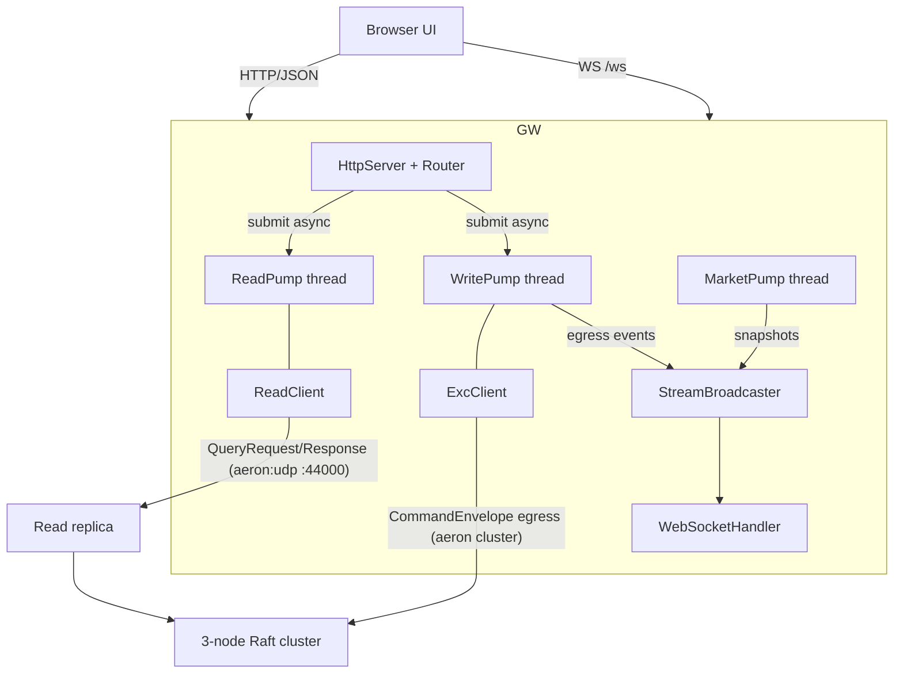
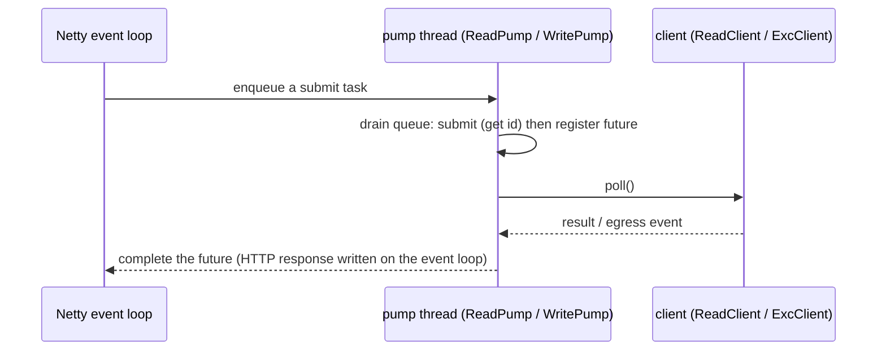

# exc-gateway - HTTP/JSON + WebSocket boundary

> The read/write boundary in front of the deterministic CQRS matching engine. A
> UI talks plain HTTP/JSON (and subscribes over WebSocket); the gateway translates
> that into `ReadClient` queries and `ExcClient` commands. It never touches
> `exc-core`, and JSON stays at this boundary (as the engine rules require).

---

## Overview

`excoredum` is an in-memory spot matching engine replicated by Raft. It exposes no
network protocol for a UI on its own - reads live in a CQRS read replica
(`exc-read`) and writes go through the cluster ingress. `exc-gateway` sits between
them and the browser: a Netty HTTP/JSON server plus a WebSocket `/ws` stream.

The gateway is deliberately thin and asynchronous:

- **Reads** are answered by a read replica's `QueryResponder` over plain Aeron
  request/response streams (`ReadClient`).
- **Writes** are commands to the Raft cluster (`ExcClient`), each acknowledged by
  a deterministic `CommandResult`.
- **Streaming** (Phase 2) fans out egress trade/reduce/reject/L2 events plus
  periodic market snapshots to WebSocket subscribers.

The engine, its deterministic hot path, and the SDKs are untouched. Nothing here
is under the core determinism rules.

---

## Architecture



Two pumps own the two SDK clients; the Netty event loops never block.

---

## Module and build

- Added to `settings.gradle.kts`: `include("exc-gateway")`.
- Version catalog: Netty (`netty-codec-http`, already present) and Jackson
  (`jackson-databind`).
- `exc-gateway/build.gradle.kts`: `application` plugin, `mainClass =
  com.exadbe.gateway.GatewayLauncher`, the two Aeron/Netty `--add-opens` in
  `applicationDefaultJvmArgs`, and deps on `:exc-read-client`, `:exc-write-client`,
  `:exc-protocol`, Netty, Jackson.
- The root build already applies JDK 21, Spotless (Palantir), Checkstyle (ASCII,
  no em-dash), `-Werror`, and the test `--add-opens`.

---

## Concurrency model

`ReadClient` and `ExcClient` are **single-threaded** (`submit` + `poll` on one
thread). Each pump therefore owns a dedicated thread with a lock-free queue:



Because submit and poll happen on the same thread, a synchronous response is
registered before the next `poll()` can deliver it - a fast reply is never
missed. The HTTP response is written from the future completion on the correct
channel event loop, so no event loop is ever blocked.

WebSocket broadcast is thread-safe: producers call `StreamBroadcaster.publish`
from the pump/market threads; each subscriber's `StreamSink` does a Netty
`Channel.writeAndFlush` (thread-safe). A failing sink is skipped.

---

## REST API (JSON)

### Read (via `ReadClient`)

| Method | Path                                    | Backed by                          |
|--------|-----------------------------------------|------------------------------------|
| GET    | `/api/v1/health`                        | `stateHash` + `totalCurrencyBalance` + client stats |
| GET    | `/api/v1/symbols`                       | config `SymbolRegistry`            |
| GET    | `/api/v1/orderbook?symbolId&maxLevels`  | `orderBook(symbolId, maxLevels)`   |
| GET    | `/api/v1/markettrades?symbolId&limit`   | `marketTrades(symbolId, limit)`    |
| GET    | `/api/v1/report/conservation`           | `totalCurrencyBalance()`           |
| GET    | `/api/v1/users/{uid}/balances`          | `singleUserReport(uid)`            |
| GET    | `/api/v1/users/{uid}/orders`            | `orderHistory(uid)`                |
| GET    | `/api/v1/users/{uid}/orders/active`     | `activeOrders(uid)`                |
| GET    | `/api/v1/users/{uid}/trades?limit`      | `userTrades(uid, limit)`           |
| GET    | `/api/v1/orders/{orderId}`              | `order(orderId)`                   |

### Write - trading

| Method | Path                            | Backed by                       |
|--------|---------------------------------|---------------------------------|
| POST   | `/api/v1/orders`                | `placeGtc` / `placeIoc` / `placeFokBudget` |
| DELETE | `/api/v1/orders/{orderId}`      | `cancelOrder`                   |
| PATCH  | `/api/v1/orders/{orderId}`      | `moveOrder` (price) or `reduceOrder` (size) |
| POST   | `/api/v1/orderbook/{symbolId}/request` | `requestOrderBook`          |

`POST /orders` body: `{symbolId, orderId, ask, type, price, size,
reserveBidPrice, uid, userCookie}` with `type` in `GTC | IOC | FOK_BUDGET`.
`PATCH /orders/{id}` body: `{symbolId, uid, price}` (move) or `{symbolId, uid,
size}` (reduce).

### Write - admin (requires `X-User-Id` in the configured allow-list)

| Method | Path                                | Backed by             |
|--------|-------------------------------------|-----------------------|
| POST   | `/api/v1/symbols`                   | `addSymbol`           |
| POST   | `/api/v1/users`                     | `addUser`             |
| POST   | `/api/v1/users/{uid}/balance`       | `adjustBalance`       |
| POST   | `/api/v1/users/{uid}/suspend`       | `suspendUser`         |
| POST   | `/api/v1/users/{uid}/resume`        | `resumeUser`          |

Every write returns a `WriteResultDto`: `{commandIdHi, commandIdLo, resultCode,
uid, orderId, filledSize}` (boxed fields are `null` when absent from the wire
result).

---

## WebSocket streaming (`/ws`)

Connect to `ws://host:port/ws`. On upgrade the channel becomes a
`StreamBroadcaster` subscriber and receives JSON envelopes. The client filters
by symbol; the gateway broadcasts to all subscribers. Event types:

| `type`       | Fields                                                                          | Source                  |
|--------------|---------------------------------------------------------------------------------|-------------------------|
| `TRADE`      | `commandIdLo`, `eventIndex`, `symbolId`, `makerOrderId`, `makerUid`, `takerUid`, `price`, `size`, `makerCompleted` | `ExcClient` egress (write pump) |
| `REDUCE`     | `commandIdLo`, `eventIndex`, `symbolId`, `orderId`, `uid`, `reducedBy`, `price`, `completed` | `ExcClient` egress |
| `REJECT`     | `commandIdLo`, `eventIndex`, `symbolId`, `orderId`, `uid`, `rejectedSize`, `price` | `ExcClient` egress |
| `L2`         | `symbolId`, `appliedPosition`, `asks[]`, `bids[]` (`{price, size, orders}`)      | egress snapshot or `MarketPump` |
| `MARKET_TAPE`| `symbolId`, `trades[]` (`{timestamp, price, size, makerOrderId, makerUid, takerUid}`) | `MarketPump` |

`MarketPump` polls `orderBook` + `marketTrades` for each config symbol on an
interval and publishes `L2` / `MARKET_TAPE` snapshots, so market-wide updates
are visible even with no command flowing through the gateway. Interval 0 (or no
symbols) disables it.

---

## Configuration

Launcher reads a properties file via `--config=<path>` (or `--config <path>`):

| Property                                   | Default                                        | Purpose                                  |
|--------------------------------------------|------------------------------------------------|------------------------------------------|
| `gateway.http.host`                         | `0.0.0.0`                                      | HTTP bind address                        |
| `gateway.http.port`                         | `8080`                                         | HTTP bind port                           |
| `gateway.read.requestChannel`               | `aeron:udp?endpoint=localhost:44000`           | Read replica query channel               |
| `gateway.read.requestStreamId`              | `300`                                          | Read request stream                      |
| `gateway.read.responseStreamId`             | `301`                                          | Read response stream                     |
| `gateway.read.aeronDir`                     | (embedded media driver)                        | Shared Aeron dir, if any                 |
| `gateway.write.clientId`                    | `1`                                            | Write client id (per-process unique)     |
| `gateway.write.initialClientSeq`            | `0`                                            | First client sequence (advance per restart) |
| `gateway.write.ingressEndpoints`            | `localhost:20100`                              | Cluster ingress endpoints                |
| `gateway.write.egressChannel`               | `aeron:udp?endpoint=localhost:0`               | Write egress channel                     |
| `gateway.write.aeronDir`                    | (embedded media driver)                        | Shared Aeron dir, if any                 |
| `gateway.admin.uids`                        | (empty)                                        | Admin `X-User-Id` allow-list             |
| `gateway.symbols`                           | (empty)                                        | `id\|name\|base\|quote\|baseScaleK\|quoteScaleK[|makerFee|takerFee]`, comma separated |
| `gateway.currencies`                        | (empty)                                        | `id\|code\|scaleK`, comma separated (UI balance naming/scaling) |
| `gateway.marketPump.intervalMs`             | `1000`                                         | Market snapshot interval (0 disables)    |

---

## Identity and errors

- **Identity** is transport-level only: `X-User-Id` (long) identifies the acting
  user; admin routes require that uid to be in `gateway.admin.uids` else `403`.
  The engine keeps its own `uid` model; the gateway only forwards it.
- **Errors** map to HTTP status:

| Status | Meaning                                                        |
|--------|----------------------------------------------------------------|
| 200    | Success                                                        |
| 400    | Bad request / malformed input / non-admin missing header       |
| 403    | Not an allowed admin                                           |
| 404    | No route, unknown order                                        |
| 429    | Read/write in-flight window full                               |
| 500    | Serialization / submit failure                                 |
| 504    | Query or command timeout / expired                             |

---

## Running

```bash
# Start the read replica and cluster first, then:
./gradlew :exc-gateway:run --args="--config=gateway.properties"
```

Example `gateway.properties`:

```properties
gateway.http.port=8080
gateway.read.requestChannel=aeron:udp?endpoint=localhost:44000
gateway.write.clientId=42
gateway.write.ingressEndpoints=localhost:20100,localhost:20200,localhost:20300
gateway.admin.uids=1,2,811
gateway.symbols=1|BTC/USDT|10|20|1000000|100000|1000|5000,2|ETH/USDT|10|20|1000000|100000|1000|5000
gateway.currencies=10|BTC|1000000,20|USDT|100000
gateway.marketPump.intervalMs=1000
```

---

## Verification

- **Unit** (`exc-gateway/src/test`): `MapperTest`, `GatewayConfigTest`,
  `HandlerRequestTest`, `JsonTest`, `StreamBroadcasterTest`.
- **End to end** (`exc-tests`, tag `integration`):
  `GatewayEndToEndIntegrationTest` boots an in-process cluster + read replica +
  gateway, then via `HttpClient` checks the order book, symbols, balance report,
  conservation totals, health, a write, the admin guard, and opens a WebSocket to
  assert a `TRADE` event streams back on a crossing order.

Gate (must pass in order, per the engine rules): `spotlessApply` ->
`checkstyleMain checkstyleTest` -> `compileJava` -> `test integrationTest` ->
`:exc-core:jmh -PquickBench`.

Browser smoke (tag `ui`, opt-in, NOT wired into `check`): boots the same
in-process cluster + replica + gateway and drives headless Chromium
(`GatewayUiSmokeTest`). Requires browser binaries:
`./gradlew :exc-tests:installPlaywrightBrowsers`, then `./gradlew :exc-tests:uiTest`.

---

## Limitations and roadmap

- **Auth** is a boundary gate only; real authentication/authorization is out of
  scope.
- **Streaming** is a coarse broadcast (client filters); per-symbol server-side
  subscription filtering is a follow-up.
- **System health** exposes `appliedPosition` / `stateHash` / conservation /
  client stats; Raft roles and `CoreMetrics` counters are not on the query
  protocol and would need a separate admin channel or a schema extension.
- A malformed `X-User-Id` currently surfaces as `500` rather than `400` (edge case).
