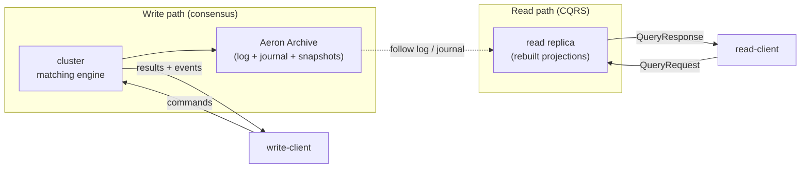
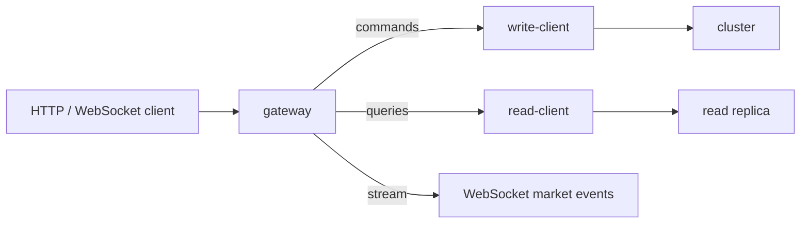

# The read path (CQRS)

How justrade answers queries - balances, order history, the book, the trade tape
- without ever touching the consensus hot path. Terms in **bold** are in the
[glossary](../GLOSSARY.md); see [../ARCHITECTURE.md](../ARCHITECTURE.md) for the
authoritative design.

## The problem: reads compete with writes

An exchange serves two very different workloads:

- Writes: a strict, ordered stream of commands that must be matched
  deterministically and fast.
- Reads: many varied queries (my balance, my open orders, the current book,
  recent trades) that can tolerate being a moment behind.

If reads ran on the matching thread, a burst of "show me the book" requests would
steal time from matching and blow the tail-latency budget. justrade separates the
two.

## CQRS: separate command and query paths

justrade applies **CQRS** (Command Query Responsibility Segregation):

- The **write path** is the cluster: commands go in, the engine matches, results
  and events come out (see [determinism-and-consensus.md](determinism-and-consensus.md)).
- The **read path** is one or more **read replicas** that follow the committed
  log and answer queries independently.

The read replica never sends anything into consensus. It only consumes, so adding
more replicas scales reads without adding load to the cluster.

## How the replica stays current

A read replica (`read`) follows a cluster member's **Aeron Archive**:

- It subscribes to the live committed log and the event **journal**.
- It replays those events through its own projections to rebuild queryable state.
- It dedups on `(logPosition, eventIndex)` so an event is applied exactly once,
  even across a leader change, matching the write side's exactly-once guarantee.

Because the replica replays the same deterministic events, its view is a faithful,
slightly-delayed image of engine state.

## What the replica can answer

The replica maintains projections tailored to queries rather than to matching:

- Per-user **balances** and value-conservation totals.
- Per-user **order history** (an order ledger rebuilt from the log).
- The **L2 book** (aggregated depth per price level) for a symbol.
- The **market trade tape** (recent trades) for a symbol.
- Single-user reports and symbol / currency metadata.

Queries arrive as `QueryRequest` messages over a plain Aeron request/response
stream and are answered with `QueryResponse`. The read-side SDK
(`read-client`) handles request-id correlation, idempotent retry, and a bounded
in-flight window.

## Where the gateway fits

Most external users do not speak Aeron. The **gateway** (`gateway`) is an
HTTP/JSON and WebSocket boundary that sits in front of both SDKs: it turns REST
calls into `write-client` commands and `read-client` queries, and streams market
events (trades, reduces, rejects, L2) over WebSocket. It is explicitly not part
of the deterministic hot path, so it can use ordinary JSON, Netty, and blocking
conveniences without affecting matching. See [../GATEWAY.md](../GATEWAY.md) and
[../API-USAGE.md](../API-USAGE.md).

## Consistency model

Reads are eventually consistent with the engine: a query reflects all events the
replica has applied so far, which lag the leader by the replication and replay
delay. For read-your-writes on a single command, a client can wait for the write
path's result (which is authoritative and immediate) and use the read path for
aggregate views and history. The write path is the source of truth; the read path
is a fast, scalable projection of it.

## Where this lives in the code

- Read replica and query responder: [read/](../../read/)
- Read-side SDK: [read-client/](../../read-client/)
- Gateway: [gateway/](../../gateway/), documented in [../GATEWAY.md](../GATEWAY.md)

Back to the [concept index](README.md) or the [docs hub](../README.md).
