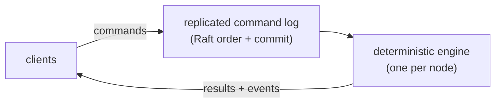
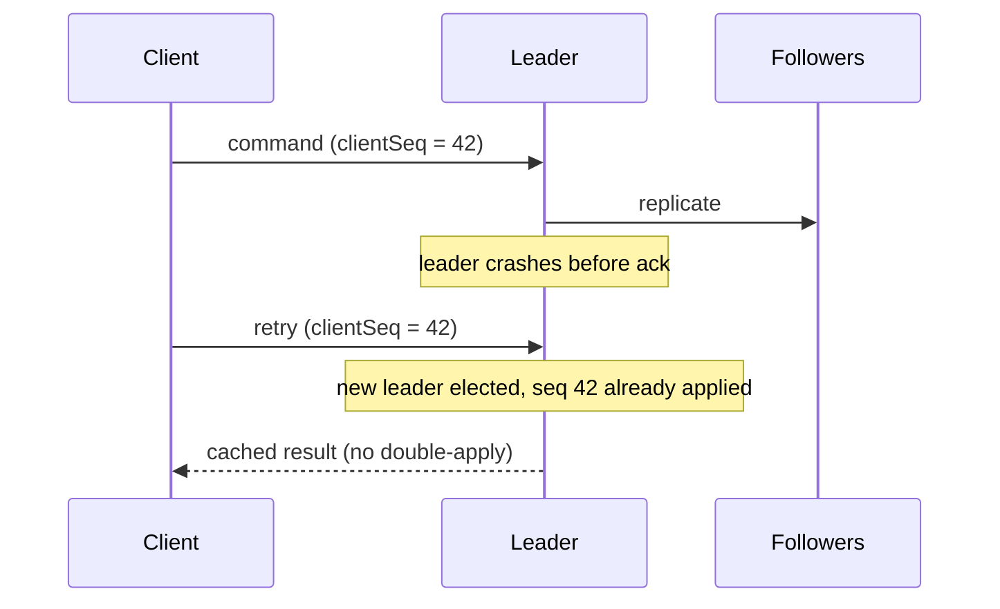

# Determinism and consensus

Why justrade is built as a single deterministic state machine replicated by Raft,
and what that buys you. This is the systems counterpart to the trading guides.
Terms in **bold** are in the [glossary](../GLOSSARY.md); the authoritative design
reference is [../ARCHITECTURE.md](../ARCHITECTURE.md).

## Why determinism matters for an exchange

A matching engine is correctness-critical. The same sequence of commands must
always produce the same trades, the same rejections, and the same order book, so
that:

- Every replica agrees on state.
- An archived log can be replayed to reproduce and audit any moment.
- Independent parties can reconcile results.

justrade guarantees this with **determinism**: identical input logs produce
byte-identical state, snapshots, and state hashes on every node and every rerun.

## What makes the engine deterministic

The engine (`core`) is a pure function of its input log. It deliberately excludes
every common source of nondeterminism:

- No wall clock. It never calls `System.currentTimeMillis()` or `nanoTime()`;
  time is supplied by the cluster as the leader's timestamp on each command.
- No randomness. No `Random`, no `UUID.randomUUID()`.
- No floating point. All money is **fixed-scale 64-bit integer** arithmetic with
  overflow checks.
- No unordered iteration. No `HashMap` iteration order leaking into behavior;
  primitive maps and sorted structures only.
- Single-writer. One thread owns all mutable state, so there are no data races
  and no lock-ordering nondeterminism.

Because of this, "replay the log" always yields the same answer. A replay test
asserts a recorded session produces a byte-identical session out.

## Commands, log, and state machine

The system is a classic replicated state machine:

The log is the source of truth. The engine is a deterministic reducer over the
log. Replicate the log consistently and every node's engine reaches the same
state.

## Consensus with Aeron Cluster (Raft)

justrade uses **Aeron Cluster**, an implementation of the **Raft** consensus
algorithm, to replicate the command log across nodes:

- One node is the **leader**; it sequences incoming commands and assigns each a
  timestamp.
- Commands are replicated to followers and **committed** once a majority has them.
- The engine runs the committed log identically on every node.
- If the leader fails, Raft elects a new one from an up-to-date follower; the log
  and therefore the state survive.

The leader's timestamp is the engine's only notion of time, which keeps time
itself deterministic and replicated.

## Exactly-once, even across failover

Clients retry. Leaders die mid-flight. Without care, a command could apply twice
or be lost. justrade makes every command **idempotent** with a per-client dedup
window keyed on `(clientId, clientSeq)`:

- Each client stamps commands with a monotonically increasing `clientSeq`.
- The engine remembers recent `(clientId, clientSeq)` results.
- A replayed or retried command returns the cached result instead of applying
  again.

The result is **exactly-once** semantics: a client retry, a leader change, or a
killed leader can never double-apply a command. The dedup table lives in
[core/.../collections](../../core/src/main/java/io/justrade/collections/) and is
part of the deterministic snapshot.

## Snapshots and warm restart

Replaying an entire log from the beginning would be slow. Periodically the engine
writes a **snapshot**: its full state streamed to the Aeron Archive in sorted key
order with an integrity checksum. On restart a node loads the latest snapshot and
replays only the remaining log, reaching the same deterministic state faster.

## The hot path stays fast

Determinism does not come at the cost of speed. The steady-state per-command
**hot path** (decode, match, settle, acknowledge) allocates nothing, takes no
locks, and is single-writer. Journaling and reads happen off the consensus
thread, so recording history and answering queries never stall matching. See the
performance budget in [../decisions/performance-budget.md](../decisions/performance-budget.md)
and the full design in [../ARCHITECTURE.md](../ARCHITECTURE.md).

## Where this lives in the code

- Engine dispatch: [core/.../engine/MatchingEngine.java](../../core/src/main/java/io/justrade/engine/MatchingEngine.java)
- Cluster bootstrap and consensus: [launcher/](../../launcher/)
- Dedup and snapshot collections: [core/.../collections](../../core/src/main/java/io/justrade/collections/)

Next: [cqrs-read-path.md](cqrs-read-path.md).
