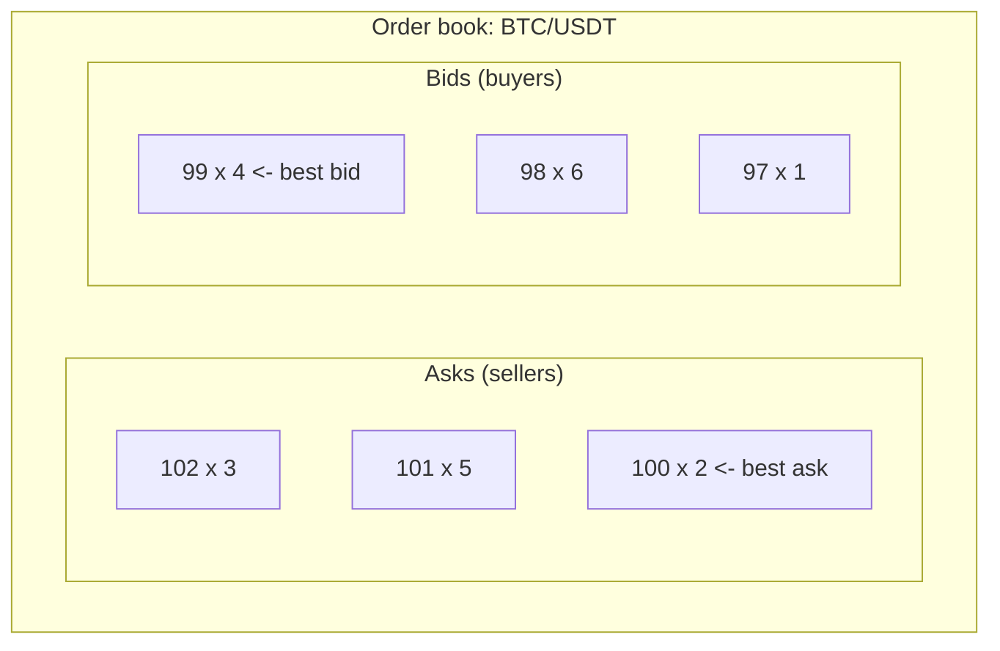
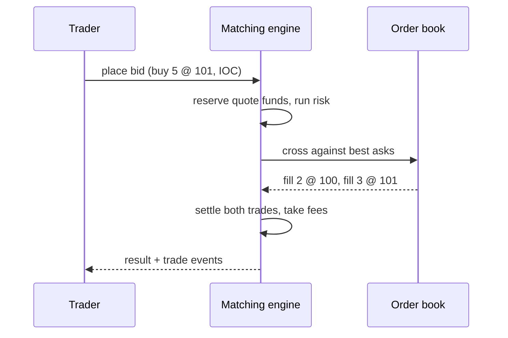

# Exchange 101: how a spot exchange works

This guide introduces the trading concepts justrade implements, for readers who
know software but not markets. If you already know order books and maker/taker
fees, skip to [order-book-matching.md](order-book-matching.md). Terms in **bold**
are defined in the [glossary](../GLOSSARY.md).

## What an exchange does

An exchange is a marketplace that matches buyers and sellers of an asset. A
**spot** exchange settles trades immediately at the traded price: when a buy and
a sell agree, the assets change hands right away. There is no borrowing, no
leverage, and no future settlement date. justrade is a spot exchange.

Each tradable market is a **symbol**, for example BTC/USDT. A symbol pairs two
currencies:

- The **base currency** is what you are buying or selling (BTC). Order **size**
  is measured in base units.
- The **quote currency** is what you pay with (USDT). **Price** is measured in
  quote units per one unit of base.

An order to "buy 10 BTC at 100 USDT" has size 10 (base) and price 100 (quote),
for a **notional** of `price * size = 1000` USDT.

## Orders: bids and asks

Participants express intent with orders:

- A **bid** is an order to buy.
- An **ask** (or offer) is an order to sell.

Every order names a symbol, a side (bid or ask), a price, and a size. Orders
that are not immediately matched can rest in the **order book**.

## The order book

The order book is the heart of the exchange: a two-sided, price-ordered list of
all resting orders for a symbol.

- The **best ask** is the lowest price a seller will accept (100 above).
- The **best bid** is the highest price a buyer will pay (99 above).
- The gap between them is the **spread**.

When the best bid is below the best ask, nothing trades: buyers want to pay less
than sellers will accept, so orders rest and wait.

## Matching: when a trade happens

A trade happens when an incoming order crosses the book, that is, a buy priced at
or above the best ask, or a sell priced at or below the best bid. The incoming
order is the **taker** (it takes liquidity); the resting order it hits is the
**maker** (it made liquidity available).

Example: with the book above, someone submits "buy 5 at 101".

1. It matches the best ask first: 2 units at 100 (a **fill**), leaving 3 to buy.
2. It then matches the next ask: 3 units at 101, fully filling the order.
3. The taker bought 5; two makers were consumed; two **trades** are produced.

Crucially, each fill executes at the maker's resting price, not the taker's
limit. The taker set 101 as the worst price it would accept, but the first 2
units filled at the better price of 100.

## Price-time priority

When multiple orders could match, which goes first? justrade uses **price-time
priority**:

1. Price first: better prices match ahead of worse ones (higher bids and lower
   asks are better).
2. Time second: among orders at the same price, the one that arrived earliest
   matches first (first-in, first-out).

This is the fairness contract of the exchange, and it must be deterministic.
Details and the data structures are in
[order-book-matching.md](order-book-matching.md).

## What happens to unmatched size

Not every order fully fills. What happens to the remainder depends on the
**order type**:

- **GTC** (Good-Till-Canceled): the remainder rests in the book until it fills or
  is canceled.
- **IOC** (Immediate-Or-Cancel): the remainder is canceled immediately, never
  rested.
- **FOK-BUDGET** (Fill-Or-Kill): the order must fill entirely or be rejected with
  nothing done.

See [order-types.md](order-types.md).

## Funding, risk, and fees

Because justrade is a spot exchange, participants must fully fund their orders
before trading (**direct-exchange risk**):

- To bid (buy), you must hold enough quote currency for the notional.
- To ask (sell), you must hold enough base currency for the size.

When an order is placed, the required funds are **reserved** so the trade can
always settle; the reserve is released if the order is canceled or reduced. When
a trade settles, currency moves between the two parties, and a small **maker /
taker fee** is taken on the quote side and accrues to a fee account. Total value
is conserved: what one side loses, the counterparty and the fee account gain. See
[risk-and-fees.md](risk-and-fees.md).

## Reads: seeing the market

Traders also need to see state: their balances, their order history, the current
book, and the stream of recent trades (the "tape"). justrade serves these from a
separate **read replica** so that reading never slows down matching. See
[cqrs-read-path.md](cqrs-read-path.md).

## Putting it together

That is the whole loop: fund, place, match by price-time priority, settle, and
report. The rest of these guides explain how justrade does each step
deterministically and without allocating memory on the hot path.

## Where this lives in the code

- Matching: [core/.../engine/MatchingEngine.java](../../core/src/main/java/io/justrade/engine/MatchingEngine.java)
- Order book: [core/.../engine/orderbook/OrderBookNaive.java](../../core/src/main/java/io/justrade/engine/orderbook/OrderBookNaive.java)
- Risk and fees: [core/.../engine/risk/DirectExchangeRisk.java](../../core/src/main/java/io/justrade/engine/risk/DirectExchangeRisk.java)

Next: [order-book-matching.md](order-book-matching.md).
