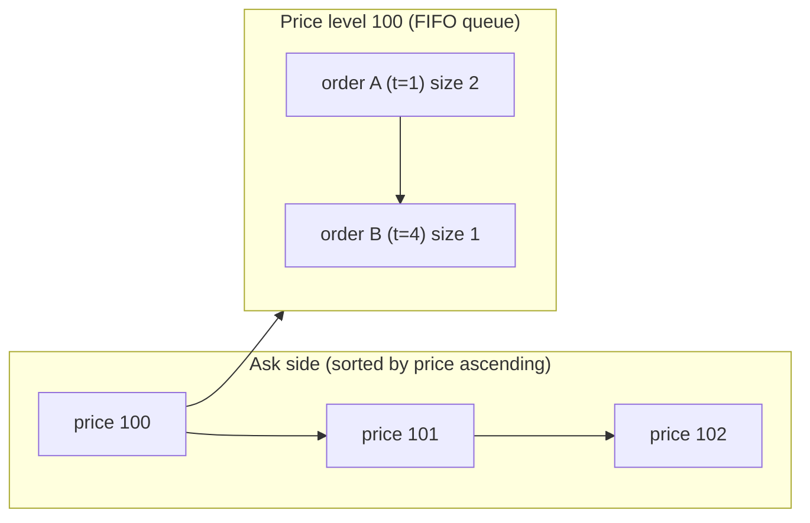
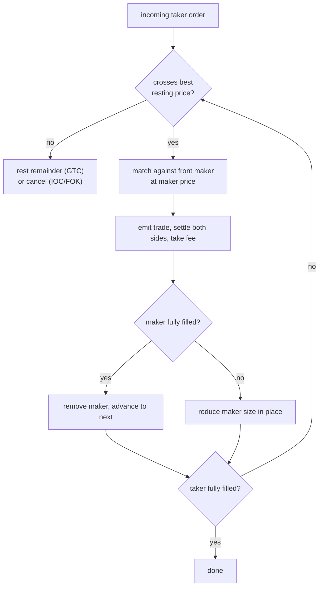

# Order book and matching

How justrade stores resting orders and matches incoming ones under price-time
priority. Read [exchange-101.md](exchange-101.md) first if the terms bid, ask,
maker, taker, or spread are new. Terms in **bold** are in the
[glossary](../GLOSSARY.md).

## The matching contract

justrade matches under **price-time priority**:

1. Better price wins. Higher bids and lower asks are better and match first.
2. Equal price ties break by arrival time. The earliest resting order at a price
   fills first (FIFO).

This rule must produce the same result on every node and every replay, so the
data structures and iteration order are fully deterministic: no hash-map
iteration, no wall-clock tie-breaks, no randomness.

## Structure of the book

Each symbol has one order book with two sides. Each side is a set of price
levels; each price level holds a time-ordered queue of orders.

Two levels of ordering:

- Across price levels: asks ascending (lowest first), bids descending (highest
  first), so the front of each side is always the best price.
- Within a price level: a first-in-first-out queue, so equal prices honor arrival
  time.

In code, a side is [OrderBookSide.java](../../core/src/main/java/io/justrade/engine/orderbook/OrderBookSide.java),
a price level is [PriceBucket.java](../../core/src/main/java/io/justrade/engine/orderbook/PriceBucket.java),
and a resting order is [OrderNode.java](../../core/src/main/java/io/justrade/engine/orderbook/OrderNode.java).
The two-sided book is [OrderBookNaive.java](../../core/src/main/java/io/justrade/engine/orderbook/OrderBookNaive.java).

## No allocation while trading

A live exchange places and cancels orders millions of times. Allocating an
object per order would create garbage and unpredictable GC pauses, which breaks
the tail-latency contract. justrade avoids this by pooling:

- Order nodes come from [OrderNodePool.java](../../core/src/main/java/io/justrade/engine/orderbook/OrderNodePool.java).
- Price buckets come from [PriceBucketPool.java](../../core/src/main/java/io/justrade/engine/orderbook/PriceBucketPool.java).

Placing an order takes a node from the pool and links it into the right price
level; canceling returns it. Steady-state matching allocates nothing.

## The matching loop

When a taker order arrives, the engine walks the opposite side from the best
price outward, filling as it goes:

Key points:

- Each fill executes at the maker's price, giving the taker price improvement
  when the book is better than its limit.
- A partially filled maker stays at the front of its price level with reduced
  size; a fully filled maker is removed and the next one (same price, later time)
  becomes the front.
- The loop stops when the taker is filled or the book no longer crosses.

## What happens to leftovers

If the taker cannot fully fill, the order type decides the remainder:

- **GTC**: the remainder becomes a new resting maker at its limit price.
- **IOC**: the remainder is canceled and a **reduce** event is emitted.
- **FOK-BUDGET**: if it cannot fully fill, nothing is done and the order is
  rejected. See [order-types.md](order-types.md).

## Other book operations

Beyond place and the implicit match:

- **CANCEL** removes a resting order and emits a reduce for the removed size.
- **REDUCE** lowers a resting order's remaining size and releases the freed
  reserve.
- **MOVE** changes a resting order's price. Because price changed, the order
  loses its time priority and goes to the back of the queue at the new price
  level (and may immediately cross, becoming a taker).

## L2 view for readers

Individual orders are an internal detail. External consumers see the **L2 book**:
aggregated size per price level, capped at a configured depth. That projection is
[L2View.java](../../core/src/main/java/io/justrade/engine/orderbook/L2View.java),
and it is what the read replica and streaming APIs expose
(see [cqrs-read-path.md](cqrs-read-path.md)).

## Why "naive"

The reference book is called `OrderBookNaive` because it favors a clear,
obviously-correct structure over exotic optimizations. It is the parity reference
against exchange-core: on the same replayed workload it must produce identical
trades, rejects, reduces, and a byte-identical L2 book (see
[../BENCHMARKING-XCORE.md](../BENCHMARKING-XCORE.md)). Correctness first, then
speed.

Next: [order-types.md](order-types.md) or [risk-and-fees.md](risk-and-fees.md).
