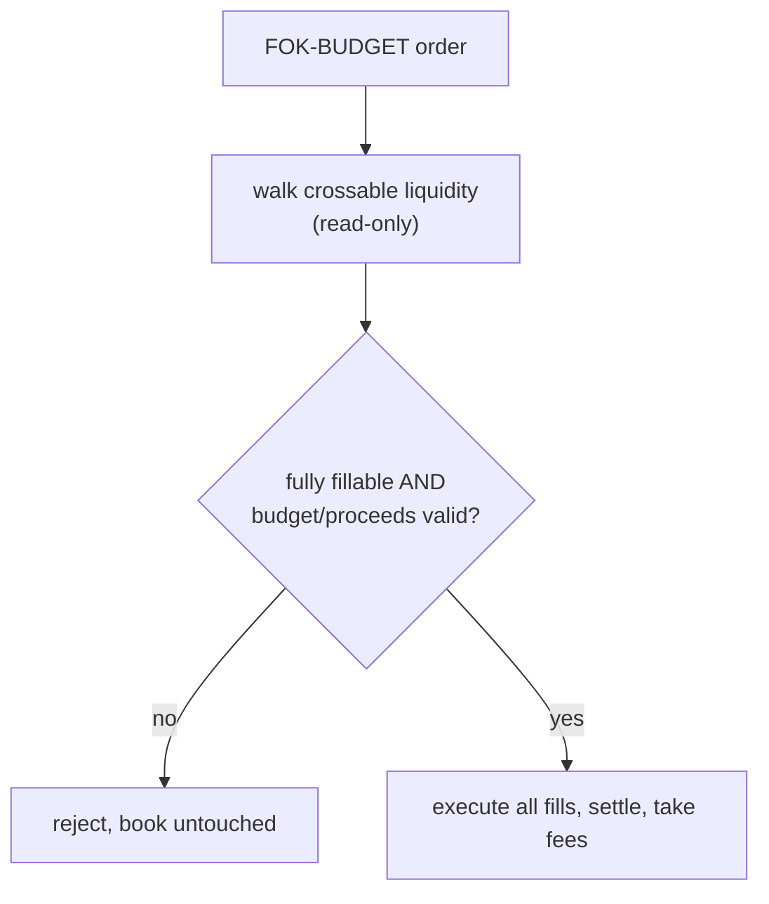

# Order types

justrade supports three order types and four order operations. They differ only
in what happens to size that cannot fill immediately. Read
[order-book-matching.md](order-book-matching.md) first. Terms in **bold** are in
the [glossary](../GLOSSARY.md).

## The three order types

### GTC (Good-Till-Canceled)

A GTC order matches whatever it can immediately, then rests the remainder in the
book as a **maker** until it fills or is canceled. This is the default
liquidity-providing order.

- Fully crosses: fills entirely as a taker, nothing rests.
- Partially crosses: fills what it can, rests the remainder at its limit price.
- Does not cross: rests entirely.

Example: book best ask is 100 x 2. A GTC "buy 5 @ 100" fills 2 at 100, then rests
3 at 100 as a new bid.

### IOC (Immediate-Or-Cancel)

An IOC order matches whatever liquidity is available right now, then cancels any
remainder instead of resting. Use it to take liquidity without leaving a resting
order behind.

- Fully crosses: fills entirely.
- Partially crosses: fills what it can; the remainder is canceled and a
  **reduce** event is emitted.
- Does not cross: fills nothing; the whole order is canceled.

Example: the same "buy 5 @ 100" as IOC fills 2 at 100 and cancels 3.

### FOK-BUDGET (Fill-Or-Kill with budget reserve)

A FOK-BUDGET order must fill entirely or do nothing. It is all-or-nothing: if the
book cannot fully fill it, it is **rejected** and the book is not touched.

- Fully fillable: fills entirely as a taker.
- Not fully fillable: rejected, nothing rests, nothing settles.

The "budget" part matters for bids. Before mutating the book, the engine walks
the crossable liquidity, sums the quote **notional** the fill would cost, and
checks that the buyer has budgeted enough quote funds (including fees and within
the 64-bit range) to pay for the whole thing. Only if the budget holds does it
execute. This pre-validation is deliberate: a settlement failure is never
overwritten with a success after the book has already changed.

For asks, the symmetric pre-validation checks that the proceeds clear the fee
floor and the 64-bit range before the book is mutated. This is recorded in
[ADR 0002](../decisions/0002-fok-budget-ask-settlement.md).

## Choosing a type

| Goal                                          | Type       |
|-----------------------------------------------|------------|
| Provide liquidity, leave a resting order      | GTC        |
| Take available liquidity, no resting leftover | IOC        |
| All-or-nothing execution                      | FOK-BUDGET |

## The four order operations

Order type is about placement. Separately, four operations act on orders:

- **PLACE** - submit a new order (with one of the types above).
- **CANCEL** - remove a resting order; emits a reduce for the removed size and
  releases its reserve.
- **MOVE** - change a resting order's price. It loses time priority and goes to
  the back of the new price level; it may immediately cross and become a taker.
- **REDUCE** - decrease a resting order's remaining size, releasing the freed
  reserve.

## Egress events

Regardless of type, matching produces a small set of events delivered to clients:

- **Trade** - a fill between taker and maker at the maker price; both sides
  settle.
- **Reduce** - size left the book without a trade (cancel, IOC remainder, or
  explicit reduce).
- **Reject** - the command was not applied (validation or risk failure, or a
  FOK-BUDGET that could not fully fill).

## Where this lives in the code

- Dispatch and matching: [core/.../engine/MatchingEngine.java](../../core/src/main/java/io/justrade/engine/MatchingEngine.java)
- Risk and settlement pre-validation: [core/.../engine/risk/DirectExchangeRisk.java](../../core/src/main/java/io/justrade/engine/risk/DirectExchangeRisk.java)
- FOK-BUDGET ask decision: [ADR 0002](../decisions/0002-fok-budget-ask-settlement.md)

Next: [risk-and-fees.md](risk-and-fees.md).
