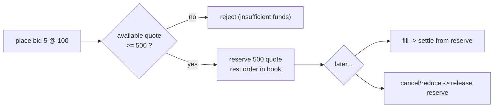

# Risk, funding, and fees

How justrade keeps trading solvent: every order is fully funded before it can
match, and every trade conserves value including fees. Read
[exchange-101.md](exchange-101.md) first. Terms in **bold** are in the
[glossary](../GLOSSARY.md).

## Direct-exchange (spot) risk

justrade uses **direct-exchange risk**: the pure spot model. There is no margin,
no leverage, and no short selling. A participant can only trade with funds they
actually hold:

- To **bid** (buy) `size` at `price`, you must hold at least the quote
  **notional** `price * size` in the quote currency.
- To **ask** (sell) `size`, you must hold at least `size` in the base currency.

This makes the exchange always solvent by construction: there is no scenario
where a settled trade cannot be paid for.

## Reserve on placement

When an order is placed and passes risk, the required funds are **reserved**
(locked) so the eventual fill can always settle:

- A resting bid reserves quote funds equal to its notional.
- A resting ask reserves base funds equal to its size.

Reserved funds are not spendable by other orders. If the order is later canceled
or reduced, the corresponding reserve is released back to the available balance.

## Settlement on a trade

When a taker crosses a resting maker, a **trade** settles immediately at the
maker's price. Both parties exchange currency:

- The buyer pays quote and receives base.
- The seller receives quote and delivers base.

Because the maker's funds were reserved at placement, settlement draws from the
reserve; the taker is checked and debited as part of processing. All amounts are
**fixed-scale 64-bit integers** with overflow checks, never floating point, so
the arithmetic is exact and reproducible on every node.

## Maker and taker fees

A fee is taken on the quote side of each fill:

- The **taker** (the incoming, liquidity-removing order) typically pays a fee.
- The **maker** (the resting order) may receive a rebate.

Fees are configured per symbol and accrue to a dedicated **fee account**. The net
of taker fee minus maker rebate is the exchange's revenue on that fill.

## Value conservation

The core financial invariant is that a trade neither creates nor destroys value.
Across the two parties and the fee account, the sum of quote-currency changes is
zero, and the sum of base-currency changes is zero. Informally: whatever the
taker loses, the maker and the fee account gain.

This is not just documentation; it is enforced by a property test asserting that
`taker + maker + fee` is constant across a trade (see the
[testing tier](../../CONTRIBUTING.md#tests-and-benchmarks)). If a change ever
broke conservation, the build would fail.

## Rejections

Risk rejects a command rather than partially applying it when, for example:

- The user is unknown or **suspended**.
- Available funds are below the required notional (bid) or size (ask).
- The price or size is invalid for the symbol.
- A FOK-BUDGET order cannot fully fill within budget (see
  [order-types.md](order-types.md)).

A reject changes no balances and mutates no book. For FOK-BUDGET in particular,
settlement is pre-validated before the book is touched, so a settlement failure
can never be masked by a success after the fact
([ADR 0002](../decisions/0002-fok-budget-ask-settlement.md)).

## Symbol specification

Each symbol carries the parameters risk needs: its base and quote currencies,
currency scale factors, fee rates, and size limits. That configuration lives in
[SymbolSpec.java](../../core/src/main/java/io/justrade/engine/risk/SymbolSpec.java),
stored in [SymbolSpecStore.java](../../core/src/main/java/io/justrade/engine/risk/SymbolSpecStore.java).
Accounts and balances are held in the ledger collections under
[core/.../collections](../../core/src/main/java/io/justrade/collections/).

## Where this lives in the code

- Risk checks, reserve, settlement, fees: [core/.../engine/risk/DirectExchangeRisk.java](../../core/src/main/java/io/justrade/engine/risk/DirectExchangeRisk.java)
- Symbol parameters: [core/.../engine/risk/SymbolSpec.java](../../core/src/main/java/io/justrade/engine/risk/SymbolSpec.java)
- FOK-BUDGET settlement decision: [ADR 0002](../decisions/0002-fok-budget-ask-settlement.md)

Next: [determinism-and-consensus.md](determinism-and-consensus.md).
